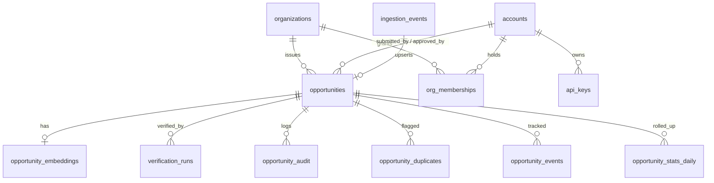

# RFP Hub — Postgres Data Model (sketch)

Storage model backing the public `/v1/` API (M2).
Target: **PostgreSQL 15+** with `pgvector` (semantic dedup) and `pg_trgm`. This is the
*internal* model — a clean-slate redesign, intentionally NOT a copy of any single source
system's schema. It maps onto, but is independent from, the public
[RFP Hub Standard v1.0.0](../../standard/schemas/v1.0.0/opportunity.schema.json).

## Principles

1. **Hybrid relational + JSONB.** Typed columns for everything the API filters/sorts/searches
   on (the live filters are type, ecosystem, network, status, grant size, text). Normalized
   FKs for real entities (organizations, accounts). `JSONB` only for the genuinely variable
   bits: the per-type block and `extensions`.
2. **Type-as-key via one JSONB column.** The discriminated-union payload lives in
   `opportunities.type_data`; the API serves it under a key equal to `type` (so
   `opportunity[opportunity.type]` works) without per-type tables/columns.
3. **Provenance-first.** `source_url` is `NOT NULL`. Verification history and source snapshots
   are append-only side tables.
4. **Append-only history.** Audit trail, verification runs, analytics events, and dataset
   snapshots are insert-only (no UPDATE/DELETE) — satisfies the M3 "append-only audit trail".
5. **Editorial state is server-side.** `review_status` (pending/approved/rejected) is a column,
   never exposed in the public object; public reads filter to approved + listed.
6. **Idempotent ingestion.** `(source_system, original_id)` is unique; the upstream→Hub outbox
   is deduped by an event-id table so at-least-once delivery is safe.

## ERD



## Enums

```sql
CREATE TYPE opportunity_type   AS ENUM ('grant','hackathon','bounty','accelerator','vc_fund','rfp');
CREATE TYPE opportunity_status AS ENUM ('upcoming','open','closed','archived');   -- public lifecycle
CREATE TYPE review_status      AS ENUM ('pending','approved','rejected');         -- server-side editorial
CREATE TYPE ingestion_method   AS ENUM ('publisher_api','submission','scrape','import','outbox');
CREATE TYPE account_role       AS ENUM ('submitter','reviewer','admin');          -- T1 / T3 / T4 (T0=no account, T2=via org membership)
CREATE TYPE org_role           AS ENUM ('owner','admin','publisher');             -- a user's role within an org
CREATE TYPE org_type           AS ENUM ('foundation','dao','company','protocol','program','individual','other');
CREATE TYPE audit_action       AS ENUM ('create','update','approve','reject','merge','close','reopen','claim','grant_publisher','revoke_publisher');
CREATE TYPE dup_status         AS ENUM ('suspected','confirmed','dismissed','merged');
CREATE TYPE analytics_event    AS ENUM ('list_view','detail_view','source_click','apply_click');
```

## Core table: `opportunities`

```sql
CREATE TABLE opportunities (
  id                 BIGINT GENERATED ALWAYS AS IDENTITY PRIMARY KEY,  -- internal FK target
  public_id          TEXT NOT NULL UNIQUE,            -- standard `id`, e.g. 'filecoin:propgf-batch-3'
  spec_version       TEXT NOT NULL DEFAULT '1.0.0',
  type               opportunity_type   NOT NULL,
  status             opportunity_status NOT NULL,

  title              TEXT NOT NULL,
  description        TEXT NOT NULL,
  summary            TEXT,

  organization_id    BIGINT NOT NULL REFERENCES organizations(id),

  application_url    TEXT,
  website            TEXT,
  logo_url           TEXT,
  banner_url         TEXT,
  social_links       JSONB NOT NULL DEFAULT '{}',     -- small fixed shape; not filtered

  -- classification (open lists per the ETH-scoped standard) — filtered via GIN
  ecosystems         TEXT[] NOT NULL DEFAULT '{}',
  networks           TEXT[] NOT NULL DEFAULT '{}',
  categories         TEXT[] NOT NULL DEFAULT '{}',
  tags               TEXT[] NOT NULL DEFAULT '{}',

  -- funding envelope (grant-size filters)
  currency           TEXT,
  min_award          NUMERIC,
  max_award          NUMERIC,
  total_budget       NUMERIC,
  amount_distributed NUMERIC,
  awards_to_date     INTEGER,

  -- dates
  opens_at           TIMESTAMPTZ,
  closes_at          TIMESTAMPTZ,     -- deadline; drives staleness auto-close
  posted_at          TIMESTAMPTZ,

  -- discriminated-union payload (served under the `type` key) + escape hatch
  type_data          JSONB NOT NULL DEFAULT '{}',     -- = opportunity[type]
  extensions         JSONB NOT NULL DEFAULT '{}',

  -- provenance (1:1, required)
  source_url             TEXT NOT NULL,
  source_publisher       TEXT,                         -- namespace (= organizations.slug)
  ingested_via           ingestion_method,
  source_system          TEXT,                         -- e.g. an upstream system id
  original_id            TEXT,                         -- id in the source system
  verified_against_source BOOLEAN,
  verified_at            TIMESTAMPTZ,
  snapshot_url           TEXT,                          -- latest source snapshot (IPFS/archive)

  -- editorial / server-side (never in public object)
  review_status      review_status NOT NULL DEFAULT 'pending',
  submitted_by       BIGINT REFERENCES accounts(id),
  approved_by        BIGINT REFERENCES accounts(id),
  approved_at        TIMESTAMPTZ,
  is_listed          BOOLEAN NOT NULL DEFAULT TRUE,     -- soft hide without delete

  -- staleness
  last_seen_at       TIMESTAMPTZ,                       -- last confirmed-at-source / publisher touch

  -- full-text search (weighted)
  search_tsv         tsvector GENERATED ALWAYS AS (
                        setweight(to_tsvector('english', coalesce(title,'')), 'A') ||
                        setweight(to_tsvector('english', coalesce(summary,'')), 'B') ||
                        setweight(to_tsvector('english', coalesce(description,'')), 'C')
                     ) STORED,

  created_at         TIMESTAMPTZ NOT NULL DEFAULT now(),
  updated_at         TIMESTAMPTZ NOT NULL DEFAULT now(),

  UNIQUE (source_system, original_id)                  -- idempotent ingest / cross-system key
);

-- hot public query: approved + active
CREATE INDEX ix_opp_public_live ON opportunities (status, closes_at)
  WHERE review_status = 'approved' AND is_listed;
CREATE INDEX ix_opp_type        ON opportunities (type);
CREATE INDEX ix_opp_org         ON opportunities (organization_id);
CREATE INDEX ix_opp_closes_at   ON opportunities (closes_at);
CREATE INDEX ix_opp_budget      ON opportunities (total_budget);
CREATE INDEX ix_opp_award       ON opportunities (min_award, max_award);
CREATE INDEX ix_opp_updated     ON opportunities (updated_at DESC);
CREATE INDEX gin_opp_ecosystems ON opportunities USING gin (ecosystems);
CREATE INDEX gin_opp_networks   ON opportunities USING gin (networks);
CREATE INDEX gin_opp_categories ON opportunities USING gin (categories);
CREATE INDEX gin_opp_tags       ON opportunities USING gin (tags);
CREATE INDEX gin_opp_search     ON opportunities USING gin (search_tsv);
CREATE INDEX gin_opp_typedata   ON opportunities USING gin (type_data jsonb_path_ops);
```

`type_data` shape is enforced **app-side** by the same JSON Schema the `rfphub-validate` CLI
uses. Optionally enforce in-DB with the `pg_jsonschema` extension as a `CHECK`.

## Identity & access (Privy separate app + API keys)

**Model:** `accounts` are principals; `organizations` are issuers/namespaces (optionally `verified` publishers); `org_memberships` grant an account publishing rights on an org. A user can be permissioned on **many** orgs. **There is no separate publisher entity** — "publisher" = a user permissioned on a verified org.

```sql
CREATE TABLE accounts (
  id             BIGINT GENERATED ALWAYS AS IDENTITY PRIMARY KEY,
  privy_did      TEXT UNIQUE,            -- from the SEPARATE Privy app (PII isolated from any source system)
  primary_wallet TEXT,
  email          TEXT,                   -- optional; PII — lives only in this app
  display_name   TEXT,
  global_role    account_role NOT NULL DEFAULT 'submitter',   -- T1 default; T3/T4 elevate
  created_at     TIMESTAMPTZ NOT NULL DEFAULT now(),
  updated_at     TIMESTAMPTZ NOT NULL DEFAULT now()
);

CREATE TABLE api_keys (
  id           BIGINT GENERATED ALWAYS AS IDENTITY PRIMARY KEY,
  account_id   BIGINT NOT NULL REFERENCES accounts(id) ON DELETE CASCADE,
  name         TEXT,
  key_prefix   TEXT NOT NULL,            -- shown in UI for identification
  key_hash     TEXT NOT NULL,            -- store hash only (never the secret)
  scopes       TEXT[] NOT NULL DEFAULT '{read}',   -- read | write | publish
  created_at   TIMESTAMPTZ NOT NULL DEFAULT now(),
  last_used_at TIMESTAMPTZ,
  expires_at   TIMESTAMPTZ,
  revoked_at   TIMESTAMPTZ
);
CREATE UNIQUE INDEX ux_api_keys_hash ON api_keys (key_hash);

CREATE TABLE organizations (
  id            BIGINT GENERATED ALWAYS AS IDENTITY PRIMARY KEY,
  slug          TEXT NOT NULL UNIQUE,    -- the org's NAMESPACE (e.g. 'filecoin')
  name          TEXT NOT NULL,
  type          org_type,
  description   TEXT,
  website       TEXT,
  logo_url      TEXT,
  banner_url    TEXT,
  social_links  JSONB NOT NULL DEFAULT '{}',
  ecosystems    TEXT[] NOT NULL DEFAULT '{}',
  verified      BOOLEAN NOT NULL DEFAULT FALSE,   -- approved-publisher status; powers /publishers
  verified_at   TIMESTAMPTZ,
  created_at    TIMESTAMPTZ NOT NULL DEFAULT now(),
  updated_at    TIMESTAMPTZ NOT NULL DEFAULT now()
);

-- A user's publishing permissions for an org. A user MAY belong to many orgs (multiple rows);
-- an org may have many users. There is no separate "publisher" entity — publishing is a
-- permission an account holds on an organization.
CREATE TABLE org_memberships (
  id              BIGINT GENERATED ALWAYS AS IDENTITY PRIMARY KEY,
  account_id      BIGINT NOT NULL REFERENCES accounts(id) ON DELETE CASCADE,
  organization_id BIGINT NOT NULL REFERENCES organizations(id) ON DELETE CASCADE,
  role            org_role NOT NULL DEFAULT 'publisher',
  created_at      TIMESTAMPTZ NOT NULL DEFAULT now(),
  UNIQUE (account_id, organization_id)
);
```

**Auth-tier mapping (T0–T4 from the Q&A):**

| Tier | How it's represented |
|---|---|
| **T0** Public | no account; read approved+listed only |
| **T1** Submitter | any `accounts` row / API key with `write` scope → writes land `review_status='pending'` |
| **T2** Verified Publisher | an `org_memberships` row linking the account to a `verified` org → writes **within that org's namespace** auto-approve with verified provenance; out-of-namespace falls back to T1. A user can hold memberships across **multiple** orgs. No separate publisher entity — "publisher" = a user permissioned on a verified org. |
| **T3** Reviewer | `accounts.global_role='reviewer'` → approve/reject, merge dupes, grant/revoke publisher |
| **T4** Admin | `accounts.global_role='admin'` → assign/revoke reviewers |

## Supporting tables (abbreviated)

```sql
-- M3 scraping/verification-assist: append-only run log + source snapshots
CREATE TABLE verification_runs (
  id               BIGINT GENERATED ALWAYS AS IDENTITY PRIMARY KEY,
  opportunity_id   BIGINT NOT NULL REFERENCES opportunities(id) ON DELETE CASCADE,
  run_at           TIMESTAMPTZ NOT NULL DEFAULT now(),
  http_status      INT,
  exists_at_source BOOLEAN,           -- anti-spam check
  extracted        JSONB,             -- fields parsed from the page
  field_diff       JSONB,             -- mismatches vs the submission
  matched          BOOLEAN,           -- => opportunities.verified_against_source
  snapshot_url     TEXT,              -- IPFS/archived snapshot
  snapshot_sha256  TEXT
);  -- INSERT-only

-- M3 append-only audit trail of every mutation
CREATE TABLE opportunity_audit (
  id               BIGINT GENERATED ALWAYS AS IDENTITY PRIMARY KEY,
  opportunity_id   BIGINT NOT NULL REFERENCES opportunities(id) ON DELETE CASCADE,
  actor_account_id BIGINT REFERENCES accounts(id),     -- null for system jobs
  actor_kind       TEXT NOT NULL,                       -- user | api_key | job | outbox
  action           audit_action NOT NULL,
  patch            JSONB,                               -- RFC-6902 / before-after diff
  created_at       TIMESTAMPTZ NOT NULL DEFAULT now()
);  -- INSERT-only (revoke UPDATE/DELETE)

-- M3 semantic dedup at submission (pgvector)
CREATE TABLE opportunity_embeddings (
  opportunity_id BIGINT PRIMARY KEY REFERENCES opportunities(id) ON DELETE CASCADE,
  model          TEXT NOT NULL,
  embedding      vector(1536) NOT NULL,
  content_hash   TEXT NOT NULL,
  created_at     TIMESTAMPTZ NOT NULL DEFAULT now()
);
CREATE INDEX ix_opp_embed ON opportunity_embeddings USING hnsw (embedding vector_cosine_ops);

CREATE TABLE opportunity_duplicates (
  id              BIGINT GENERATED ALWAYS AS IDENTITY PRIMARY KEY,
  opportunity_id  BIGINT NOT NULL REFERENCES opportunities(id) ON DELETE CASCADE,
  duplicate_of_id BIGINT NOT NULL REFERENCES opportunities(id) ON DELETE CASCADE,
  similarity      NUMERIC,
  status          dup_status NOT NULL DEFAULT 'suspected',
  reviewed_by     BIGINT REFERENCES accounts(id),
  detected_at     TIMESTAMPTZ NOT NULL DEFAULT now(),
  reviewed_at     TIMESTAMPTZ,
  UNIQUE (opportunity_id, duplicate_of_id)
);  -- intra-Hub only; cross-system (Hub ↔ external aggregator) dedup deferred

-- Upstream → Hub outbox idempotency
CREATE TABLE ingestion_events (
  id            BIGINT GENERATED ALWAYS AS IDENTITY PRIMARY KEY,
  event_id      TEXT NOT NULL UNIQUE,        -- idempotency key from the outbox
  source_system TEXT NOT NULL,
  original_id   TEXT,
  event_type    TEXT NOT NULL,               -- upsert | delete
  payload       JSONB NOT NULL,
  received_at   TIMESTAMPTZ NOT NULL DEFAULT now(),
  processed_at  TIMESTAMPTZ,
  opportunity_id BIGINT REFERENCES opportunities(id),
  status        TEXT NOT NULL DEFAULT 'received'  -- received | processed | failed | skipped
);

-- Publisher dashboard analytics (M3): high-volume, partition by month
CREATE TABLE opportunity_events (
  id             BIGINT GENERATED ALWAYS AS IDENTITY,
  opportunity_id BIGINT NOT NULL,
  event_type     analytics_event NOT NULL,
  occurred_at    TIMESTAMPTZ NOT NULL DEFAULT now(),
  session_hash   TEXT, ip_hash TEXT, referrer TEXT
) PARTITION BY RANGE (occurred_at);

CREATE TABLE opportunity_stats_daily (   -- rollup feeding the dashboard
  opportunity_id BIGINT NOT NULL REFERENCES opportunities(id) ON DELETE CASCADE,
  day            DATE NOT NULL,
  views          INT NOT NULL DEFAULT 0,
  source_clicks  INT NOT NULL DEFAULT 0,
  apply_clicks   INT NOT NULL DEFAULT 0,
  PRIMARY KEY (opportunity_id, day)
);

-- M2 nightly exports + CC0/IPFS snapshots
CREATE TABLE dataset_snapshots (
  id           BIGINT GENERATED ALWAYS AS IDENTITY PRIMARY KEY,
  created_at   TIMESTAMPTZ NOT NULL DEFAULT now(),
  format       TEXT NOT NULL,        -- json | csv
  entry_count  INT NOT NULL,
  url          TEXT NOT NULL,        -- public bucket
  ipfs_cid     TEXT,
  sha256       TEXT,
  spec_version TEXT NOT NULL
);  -- INSERT-only
```

## Standard ↔ storage mapping

| Standard field | Storage |
|---|---|
| `id` | `opportunities.public_id` |
| `specVersion`,`type`,`status`,`title`,`description`,`summary` | same-named columns |
| `organization{}` | FK `organization_id` → `organizations` (embedded on read) |
| `source{}` | `source_url`, `source_publisher`, `ingested_via`, `source_system`, `original_id`, `verified_against_source`, `verified_at`, `snapshot_url`; `source.submittedBy` ← public handle derived from `submitted_by` account |
| `ecosystems`/`networks`/`categories`/`tags` | `TEXT[]` columns (GIN) |
| `applicationUrl`/`website`/`logoUrl`/`bannerUrl`/`socialLinks` | same-named columns (`social_links` JSONB) |
| `funding{}` | `currency`,`min_award`,`max_award`,`total_budget`,`amount_distributed`,`awards_to_date` |
| `opensAt`/`closesAt`/`postedAt`/`createdAt`/`updatedAt` | `*_at` columns |
| `opportunity[type]` (grant/hackathon/…) | **`type_data` JSONB** (served under the `type` key) |
| `extensions` | `extensions` JSONB |
| *(not in standard)* `review_status`,`is_listed`,`submitted_by`,`approved_by`,`last_seen_at` | server-side only |

## Key flows

- **Read (T0):** `WHERE review_status='approved' AND is_listed` (+ filters). List = column
  projection minus `type_data`/`extensions` (thin lists); detail = full row, `type_data`
  hoisted to the `type` key.
- **Write (T1/T2):** validate body against the Standard → resolve org/namespace → if the
  account has an `org_memberships` row for that org and the org is `verified` →
  `review_status='approved'` + run verification; else `'pending'` (community submit — no
  membership required). Every write inserts an `opportunity_audit` row.
- **Ingestion (outbox):** upsert keyed by `(source_system, original_id)`, deduped by
  `ingestion_events.event_id`; `ingested_via='outbox'`. One-way only — the Hub never
  reads back into the source system.
- **Verification (M3):** job fetches `source_url`, writes a `verification_runs` row, sets
  `verified_against_source`/`verified_at`/`snapshot_url` on the opportunity.
- **Dedup (M3):** on submit, embed the entry, ANN-search `opportunity_embeddings`, record
  matches in `opportunity_duplicates`, notify submitter.
- **Staleness (M3):** job sets `status='closed'` where `closes_at < now()`; auto-closes rows
  inactive 90+ days (by `last_seen_at`/`updated_at`). Logged in `opportunity_audit`.

## Open questions / deferred

- **Cross-system dedup** (Hub ETH ↔ an external aggregator's non-ETH registry) — deferred. The
  `(source_system, original_id)` key + `opportunity_duplicates` give us hooks, but the
  merge-precedence policy at the aggregation layer is unresolved.
- **In-DB JSONB validation** of `type_data` — optional `pg_jsonschema` CHECK vs app-only.
- **Taxonomy canonicalization** — `TEXT[]` now; a `taxonomy_terms` table (labels + aliases)
  could later canonicalize "Optimism" vs "OP Mainnet". ETH-scope is a soft/app concern, not a
  DB constraint.
- **ID scheme** — `public_id` as a human namespaced slug vs opaque ULID. Slug is friendlier and
  matches the standard examples; needs a collision/derivation rule.
- **Embedding model/dim** — `vector(1536)` is a placeholder pending the dedup model choice.
