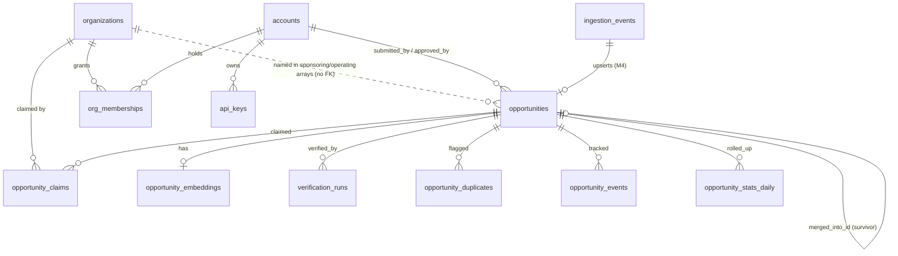

# RFP Hub — Postgres Data Model

Storage model backing the public `/v1/` API.
Target: **PostgreSQL 15+** with `pgvector` (semantic dedup) and `pg_trgm`. This is the
*internal* model — a clean-slate redesign, intentionally NOT a copy of any single source
system's schema. It maps onto, but is independent from, the public
[RFP Hub Standard v1.0.0](../../standard/schemas/v1.0.0/opportunity.schema.json).

## Implementation status

This document is the **full design target**. Each milestone implements a subset; the rest stays
here so deferred work remains discoverable. The implemented slice lives in
`packages/api/src/db/schema.ts` (Drizzle) — kept in sync with the rows below.

**Legend:** ✅ M2 · ✅ M3 (implemented) · ⏳ M4 (deferred, with its reason)

> **Re-cut note.** This model tracks **RFP Hub Standard v1.0.0 as re-cut** (see the field
> mapping table in `packages/standard/CHANGELOG.md`). Because the standard was re-cut *in place*
> and nothing had been published from this database yet, `src/db/migrations` was **regenerated
> from scratch** into a single `0000_recut_v1_0_0` migration rather than carrying a rename chain.
> Applying it to a database that already holds the pre-re-cut schema will fail: drop and
> re-migrate, then re-run the seed (every row is re-derivable from the committed corpus).
>
> **The chain is not purely generated output.** `0001` carries hand-written SQL, and M3 adds two
> deliberate CUSTOM migrations produced with `drizzle-kit generate --custom`: `0002` installs the
> `vector` extension (ordered *before* the migration that creates the vector column), and `0004`
> installs the `audit_log` append-only trigger. Neither is expressible in the Drizzle schema, and
> both belong in the versioned chain rather than hidden in `scripts/migrate.ts`, where they would
> be invisible to a reviewer and absent for an operator applying the SQL by hand. Generated
> migrations are still never hand-edited.

| Table / feature | Status |
|---|---|
| `organizations` — the org **directory**, written on ingest | ✅ M2 |
| `opportunities` core columns + provenance + `text[]`/GIN + `jsonb` org arrays / `deadlines` / `type_data` | ✅ M2 |
| `opportunities.next_deadline_at` (derived, denormalized) + `ix_opp_next_deadline` | ✅ M2 |
| `dataset_snapshots` (nightly export bookkeeping) | ✅ M2 |
| `organizations.verified`/`verified_at` + public `GET /v1/publishers` | ✅ M3 |
| `accounts` (+ `handle`, `direct_create`, `enriched_at`), `api_keys`, `org_memberships` (auth tiers T1–T4) | ✅ M3 |
| `opportunities.submitted_by`/`approved_by`/`approved_at`/`last_seen_at`/`merged_into_id` | ✅ M3 |
| **`audit_log`** — one generalized, database-enforced append-only trail (replaces `opportunity_audit`) | ✅ M3 |
| `opportunity_claims` | ✅ M3 |
| `verification_runs` (+ `snapshot_text`, `snapshot_sha256`) | ✅ M3 |
| `opportunity_embeddings` — `vector(1536)` + HNSW cosine index | ✅ M3 |
| `opportunity_duplicates` (+ self-pair CHECK + canonical-pair unique index) | ✅ M3 |
| `opportunity_events` (**plain**, not partitioned) + `opportunity_stats_daily` | ✅ M3 |
| `opportunities.search_tsv` generated `tsvector` column + `gin_opp_search` | ⏳ M4 — `ILIKE`/`pg_trgm` is adequate at this dataset size; add when volume warrants |
| `gin_opp_typedata` (GIN on `type_data`) | ⏳ M4 — nothing filters inside `type_data` yet |
| `ingestion_events` (outbox idempotency) | ⏳ M4 — see "Deferred to M4" below |
| `opportunity_events` `PARTITION BY RANGE (occurred_at)` | ⏳ M4 — see "Deferred to M4" below |

### Deferred to M4, with reasons

**`ingestion_events` (the outbox).** It exists to make at-least-once delivery from an upstream
system idempotent. M3 ships no outbox consumer — every write arrives through the authenticated
submission API, where idempotency is already handled without a table (an identical repeat `POST`
returns the original result; see "Key flows"). A dedup table for a producer that does not exist
would be schema nobody can test against a real delivery.

**Partitioning `opportunity_events`.** drizzle-kit cannot generate partition DDL, so partitions
plus their maintenance would be hand-written SQL kept in step with a generated schema by hand,
indefinitely. At this volume partitioning buys nothing measurable. And the actual motive —
retention — is met by a bounded `DELETE … WHERE occurred_at < now() - ANALYTICS_RETENTION_DAYS`
in the nightly sweep, which needs no partitions at all. When volume does warrant it, the migration
path is the standard one and does not require downtime: create the partitioned table alongside,
copy in ranges, swap the names in one transaction, drop the old table.

**pgvector provisioning.** `docker-compose.yml`, `docker-compose.test.yml` and `.github/workflows/ci.yml`
all run `pgvector/pgvector:pg15` — the same major version as before, so an existing dev volume is
reused (see `scripts/upgrade-dev-postgres.sh` for the collation care the base-image change needs).
On a managed instance, whether the extension is permitted is a property of the engine version and
parameter group and is **not recorded in this repository**: `SHOW rds.extensions;` on the instance
is the authoritative check, and it is a prerequisite step in [`deploy.md`](./deploy.md) before any
M3 migration is applied.

**M2 read path (what the `/v1/` API actually touches):** `opportunities` alone, filtered by
`review_status='approved' AND is_listed` — reads no longer join `organizations` (see
"Organizations" below). `text[]`+GIN backs the ecosystem/category/organization filters,
`numeric` award columns back the grant-size ranges, `next_deadline_at` backs the deadline sort and
window filters, and `ILIKE` over `title`/`summary`/`description` backs the `q` text search (the
generated `tsvector` column is **deferred** — premature at the M2 dataset size).
`dataset_snapshots` records each nightly export.

Each ⏳ table/feature below is annotated inline where it appears.

## Principles

1. **Hybrid relational + JSONB.** Typed columns for everything the API filters/sorts/searches
   on (the live filters are funding type, ecosystem, category, status, grant size, organization,
   deadline window, text). `JSONB` for the genuinely variable or order-significant bits: the
   per-type block, the organization arrays, `deadlines` and `milestones`.
2. **One tagged-union slot via one JSONB column.** The Standard models the type-specific details
   as a single required `fundingDetails` property — a `oneOf` tagged union whose required inner
   `fundingType` tag equals the top-level discriminator (a binding `allOf` keeps the two in
   step). The payload lives in `opportunities.type_data` **without the tag**: the tag is
   derivable from the `funding_type` column, so storing it twice would only let the copies
   disagree. The read path reattaches it (`toStandard` emits
   `fundingDetails = { fundingType: row.fundingType, ...type_data }`), which makes a mismatched
   served tag structurally impossible. A second type block is likewise unrepresentable — one
   slot, one shape — so the old `assertSingleTypeBlock` ingest guard is gone.
3. **Derive-then-denormalize for anything sortable that lives in an array.** The Standard has no
   sortable deadline scalar — `deadlines[]` is an array of `{deadlineType, date?, label?}`. The API
   derives `next_deadline_at` (earliest **future** `fixed` entry) and stores it in a real,
   indexed column, recomputed on every write. Nothing sorts or ranges over JSONB.
4. **Provenance-first, but not schema-enforced.** The re-cut removed `source.url` and left
   `source` with no required member, so provenance completeness is an **ingestion-policy**
   concern here, not a `NOT NULL`. `application_url` is the single link-back target and the
   verification job's only fetch target. Verification history and source snapshots are
   append-only side tables.
5. **Append-only history.** Audit trail, verification runs, analytics events, and dataset
   snapshots are insert-only (no UPDATE/DELETE) — satisfies the M3 "append-only audit trail".
6. **Editorial state is server-side.** `review_status` (pending/approved/rejected) is a column,
   never exposed in the public object; public reads filter to approved + listed.
7. **Idempotent ingestion.** M2 ingest (seed/upsert) keys on the unique `public_id`.
   `(source_system, original_id)` carries a **partial** unique index (`ux_opp_source`, only rows
   where both are non-NULL — source-less community submissions stay unconstrained) as the
   cross-system key for the M3 outbox, which is additionally deduped by an event-id table so
   at-least-once delivery is safe.

## ERD

`audit_log` is deliberately absent from the diagram's relationships: it carries **no foreign keys**
at all (see "Audit" below), so it is related to everything and constrained by nothing.


```mermaid
erDiagram
    organizations ||..o{ opportunities : "named in sponsoring/operating arrays (no FK)"
    organizations ||--o{ org_memberships : grants
    organizations ||--o{ opportunity_claims : "claimed by"
    accounts      ||--o{ org_memberships : holds
    accounts      ||--o{ api_keys : owns
    accounts      ||--o{ opportunities : "submitted_by / approved_by"
    opportunities ||--o{ opportunity_claims : "claimed"
    opportunities ||--o| opportunity_embeddings : has
    opportunities ||--o{ verification_runs : verified_by
    opportunities ||--o{ opportunity_duplicates : flagged
    opportunities ||--o| opportunities : "merged_into_id (survivor)"
    opportunities ||--o{ opportunity_events : tracked
    opportunities ||--o{ opportunity_stats_daily : rolled_up
    ingestion_events ||--o| opportunities : "upserts (M4)"
```

## Enums

```sql
CREATE TYPE funding_type       AS ENUM ('grant','hackathon','bounty','accelerator','vc_fund','rfp');
CREATE TYPE opportunity_status AS ENUM ('upcoming','open','closed','archived');   -- public lifecycle
CREATE TYPE review_status      AS ENUM ('pending','approved','rejected');         -- server-side editorial
CREATE TYPE ingestion_method   AS ENUM ('publisher_api','submission','scrape','import','outbox');
CREATE TYPE account_role       AS ENUM ('submitter','reviewer','admin');          -- T1 / T3 / T4 (T0=no account, T2=via org membership)
CREATE TYPE org_role           AS ENUM ('owner','admin','publisher');             -- a user's role within an org
CREATE TYPE org_type           AS ENUM ('foundation','dao','company','protocol','program','individual','other');
CREATE TYPE actor_kind         AS ENUM ('user','api_key','job','outbox');
CREATE TYPE audit_subject_kind AS ENUM ('opportunity','organization','account','api_key','claim','duplicate');
CREATE TYPE audit_action       AS ENUM (
  'create','update','approve','reject','unlist','relist','close','reopen','verify_source','merge',
  'confirm_duplicate','dismiss_duplicate',
  'claim','grant_publisher','revoke_publisher',
  'verify_organization','unverify_organization','update_organization',
  'assign_role','grant_direct_create','revoke_direct_create','create_api_key','revoke_api_key');
CREATE TYPE claim_status       AS ENUM ('pending','approved','rejected','withdrawn');
CREATE TYPE dup_status         AS ENUM ('suspected','confirmed','dismissed','merged');
CREATE TYPE analytics_event    AS ENUM ('list_view','detail_view','source_click','apply_click');
```

`audit_action` is enumerated in full rather than grown one migration at a time: adding a value to a
Postgres enum is a separate `ALTER TYPE … ADD VALUE`, and a trail whose vocabulary lags the code
records the wrong verb for whatever landed first.

## Core table: `opportunities`

```sql
CREATE TABLE opportunities (
  id                 BIGINT GENERATED ALWAYS AS IDENTITY PRIMARY KEY,  -- internal FK target
  public_id          TEXT NOT NULL UNIQUE,            -- standard `id`, e.g. 'filecoin:propgf-batch-3'
  spec_version       TEXT NOT NULL DEFAULT '1.0.0',
  funding_type       funding_type       NOT NULL,     -- the Standard's structural discriminator
  status             opportunity_status NOT NULL,

  title              TEXT NOT NULL,
  description        TEXT NOT NULL,
  summary            TEXT,

  -- Organizations: ARRAYS with semantic order ([0] = primary/display), each optionally carrying
  -- contacts[]. Stored verbatim as JSONB and served back unchanged — an FK can only carry one
  -- organization and cannot carry order, so reads do not join `organizations` at all.
  -- `operating_organizations` is THE primary array (required, min 1 app-side per the Standard);
  -- sponsors are optional and may be empty.
  sponsoring_organizations JSONB NOT NULL DEFAULT '[]',
  operating_organizations  JSONB NOT NULL,            -- min 1 (enforced app-side by the Standard)
  org_slugs          TEXT[] NOT NULL DEFAULT '{}',    -- denormalized ?organization= key: operating ∪ sponsoring slugs

  application_url    TEXT,                            -- the single link-back target
  website            TEXT,
  logo_url           TEXT,
  banner_url         TEXT,
  social_links       JSONB NOT NULL DEFAULT '[]',     -- [{platform, url}] entries; not filtered

  -- classification (open lists per the ETH-scoped standard) — filtered via GIN
  ecosystems         TEXT[] NOT NULL DEFAULT '{}',
  categories         TEXT[] NOT NULL DEFAULT '{}',

  -- free-flow eligibility text + free-text qualifiers (deliberately NOT filterable)
  eligibility        TEXT,
  prerequisites      TEXT,
  additional_references TEXT,
  service_agreement  TEXT,

  -- funding envelope (grant-size filters). `allocated` = COMMITTED to date, not disbursed;
  -- `remaining` is derived (budget − allocated) at the consumer layer and never stored.
  currency           TEXT,
  min_award          NUMERIC,
  max_award          NUMERIC,
  budget             NUMERIC,
  allocated          NUMERIC,

  milestones         JSONB NOT NULL DEFAULT '[]',     -- array order IS the sequence

  -- dates
  opens_at           TIMESTAMPTZ,
  deadlines          JSONB NOT NULL DEFAULT '[]',     -- [{deadlineType:'fixed'|'rolling', date?, label?}]
  next_deadline_at   TIMESTAMPTZ,                     -- DERIVED: earliest FUTURE fixed deadline
  posted_at          TIMESTAMPTZ,

  -- discriminated-union payload (served as `fundingDetails`, tag reattached on read)
  type_data          JSONB NOT NULL DEFAULT '{}',     -- = fundingDetails minus its fundingType tag

  -- provenance (1:1) — ✅ M2. No column is NOT NULL: the Standard's `source` has no required
  -- member since the re-cut, so completeness is an ingestion-policy concern.
  source_publisher       TEXT,                         -- namespace (= organizations.slug)
  source_submitted_by    TEXT,                         -- Standard source.submittedBy (public handle/slug/'community')
  source_submitted_at    TIMESTAMPTZ,                  -- Standard source.submittedAt
  ingested_via           ingestion_method,
  source_system          TEXT,                         -- e.g. an upstream system id
  original_id            TEXT,                         -- id in the source system
  verified_against_source BOOLEAN,                     -- set by the M3 verification-assist run
  verified_at            TIMESTAMPTZ,
  snapshot_url           TEXT,                          -- ⏳ M4: OPTIONAL external archive URL — see "Snapshots"

  -- editorial / server-side (never in public object)
  review_status      review_status NOT NULL DEFAULT 'pending',  -- ✅ M2
  is_listed          BOOLEAN NOT NULL DEFAULT TRUE,     -- ✅ M2; soft hide without delete
  -- ON DELETE SET NULL, never cascade: an account going away must not take published entries with
  -- it. The permanent record of who did what is `audit_log`.
  submitted_by       BIGINT REFERENCES accounts(id) ON DELETE SET NULL,   -- ✅ M3
  approved_by        BIGINT REFERENCES accounts(id) ON DELETE SET NULL,   -- ✅ M3
  approved_at        TIMESTAMPTZ,                        -- ✅ M3
  -- Set on the LOSER of a merge, pointing at the survivor. The row is kept rather than deleted:
  -- its public id may already be in an export, a feed or a bookmark, so a merge redirects rather
  -- than 404s. A survivor that itself carries this is refused as a merge target, which is what
  -- prevents chains and cycles.
  merged_into_id     BIGINT REFERENCES opportunities(id) ON DELETE SET NULL,  -- ✅ M3

  -- staleness — ✅ M3
  last_seen_at       TIMESTAMPTZ,                       -- last confirmed-at-source / publisher touch

  -- full-text search (weighted)
  search_tsv         tsvector GENERATED ALWAYS AS (
                        setweight(to_tsvector('english', coalesce(title,'')), 'A') ||
                        setweight(to_tsvector('english', coalesce(summary,'')), 'B') ||
                        setweight(to_tsvector('english', coalesce(description,'')), 'C')
                     ) STORED,

  created_at         TIMESTAMPTZ NOT NULL DEFAULT now(),
  updated_at         TIMESTAMPTZ NOT NULL DEFAULT now()
);

-- cross-system key (M3 outbox/import): PARTIAL unique — only rows carrying BOTH a source system
-- and an original id are deduped; source-less community submissions stay unconstrained.
CREATE UNIQUE INDEX ux_opp_source ON opportunities (source_system, original_id)
  WHERE source_system IS NOT NULL AND original_id IS NOT NULL;

-- hot public query: approved + active
CREATE INDEX ix_opp_public_live   ON opportunities (status, next_deadline_at)
  WHERE review_status = 'approved' AND is_listed;
CREATE INDEX ix_opp_funding_type  ON opportunities (funding_type);
CREATE INDEX ix_opp_next_deadline ON opportunities (next_deadline_at);
CREATE INDEX ix_opp_budget        ON opportunities (budget);
CREATE INDEX ix_opp_award         ON opportunities (min_award, max_award);
CREATE INDEX ix_opp_updated       ON opportunities (updated_at DESC);
CREATE INDEX gin_opp_ecosystems   ON opportunities USING gin (ecosystems);
CREATE INDEX gin_opp_categories   ON opportunities USING gin (categories);
CREATE INDEX gin_opp_org_slugs    ON opportunities USING gin (org_slugs);
CREATE INDEX gin_opp_search       ON opportunities USING gin (search_tsv);          -- ⏳ M4
CREATE INDEX gin_opp_typedata     ON opportunities USING gin (type_data jsonb_path_ops);  -- ⏳ M4
-- ✅ M3
CREATE INDEX ix_opp_last_seen        ON opportunities (last_seen_at);      -- the staleness walk
CREATE INDEX ix_opp_submitted_by     ON opportunities (submitted_by);      -- an owner's own listings
CREATE INDEX ix_opp_source_publisher ON opportunities (source_publisher);  -- auto-approval + claims
```

`type_data` shape is enforced **app-side** by the same JSON Schema the `rfphub-validate` CLI
uses. Optionally enforce in-DB with the `pg_jsonschema` extension as a `CHECK`.

### Deadlines: `deadlines[]`, `next_deadline_at`, and auto-close

The Standard has **no** deadline scalar. `deadlines` is an array of
`{type: 'fixed' | 'rolling', date?, label?}` where consumers must **select by label**, never by
array position (the head of a hackathon's array is its event start, not its application deadline).
That leaves nothing to sort or range-scan on, so the API derives two things — both pure functions
in `src/modules/shared/deadlines.ts`, both unit-tested:

| Derivation | Definition | Used by |
|---|---|---|
| **`next_deadline_at`** | The earliest `fixed` entry whose `date` is **in the future**. `NULL` when the record is rolling-only, all its fixed dates have passed, or it has no deadlines. | `?sort=nextDeadlineAt`, `?deadlineAfter=`/`?deadlineBefore=`, the CSV export |
| **`isPastDue`** | The **latest** `fixed` entry is in the past **AND** there is **no** `rolling` entry. | staleness auto-close (✅ M3) |

`next_deadline_at` is a real, indexed `TIMESTAMPTZ` column, **denormalized and recomputed on every
write** (`fromStandard` → `OpportunityService.upsertFromStandard`). It is deliberately *not* a
generated column: "in the future" depends on `now()`, which Postgres will not accept in a
`GENERATED ALWAYS AS` expression, and a JSONB expression index could not answer a range query on
"earliest future fixed date" anyway. The consequence is that the value goes stale as time passes —
a row whose next deadline elapses keeps pointing at that past instant until it is rewritten. The
M3 staleness job that already has to walk the table for auto-close recomputes it in the same pass;
until then the seed/ingest path refreshes it on every upsert.

**Null semantics are load-bearing and public.** Records with a `NULL` `next_deadline_at` sort
**last** in both directions (`ORDER BY next_deadline_at ASC/DESC NULLS LAST`) and are **excluded**
from the `deadlineAfter`/`deadlineBefore` window filters, because there is no date to compare. That
exclusion is documented on each of those parameters in the OpenAPI document — a rolling program
silently vanishing from a deadline-window query would otherwise look like a bug.

**Auto-close is re-keyed, not just renamed.** The pre-re-cut rule was `closes_at < now()`. The
replacement is *not* "latest fixed deadline < now()" on its own: a program that publishes both an
old fixed date and a `rolling` entry is still accepting applications, so **a rolling program never
auto-closes**, however old its fixed dates are.

### Organizations

`operatingOrganizations` is the **required, primary** array with **semantic order** (`[0]` is the
primary/display organization); `sponsoringOrganizations` is an optional second array (absent or
empty when no backer is published), and each entry may carry `contacts[]`.
An FK can express neither multiplicity nor order, so both arrays are stored verbatim as JSONB on
the opportunity and are served back byte-for-byte — which is also what keeps the mapper round-trip
exact against the Standard's committed examples.

`organizations` survives as the **directory / namespace registry**, not as a read-path join: every
operating *and* sponsoring organization is upserted into it on ingest, keyed by `slug` (a
Standard-required field since the re-cut). That is what M3's `verified` flag, `/publishers`
and `org_memberships` hang off.

Filtering by organization would otherwise mean a JSONB containment scan, so `org_slugs` carries the
**union** of every operating and sponsoring organization slug, GIN-indexed.
`?organization=<slug>` therefore matches an organization in **either role**, in any array
position — not only the primary `operatingOrganizations[0]` entry.

## Identity & access (Privy separate app + API keys)

> ✅ **M3.** M2 was unauthenticated read-only (tier T0 only) and created `organizations` alone.
> `accounts`, `api_keys`, `org_memberships` and the two `verified*` columns land with the write API.

**Model:** `accounts` are principals; `organizations` are issuers/namespaces (optionally `verified` publishers); `org_memberships` grant an account publishing rights on an org. A user can be permissioned on **many** orgs. **There is no separate publisher entity** — "publisher" = a user permissioned on a verified org.

```sql
CREATE TABLE accounts (                  -- ✅ M3
  id             BIGINT GENERATED ALWAYS AS IDENTITY PRIMARY KEY,
  -- THE join key, and the only one. A wallet that reaches the API is self-asserted and would be a
  -- forgeable authorization input, so provisioning, lookup and admin bootstrap all key on the DID.
  privy_did      TEXT UNIQUE,            -- from the SEPARATE identity app (PII isolated)
  -- Filled by the enrichment job from the provider's own record, never from a request body.
  primary_wallet TEXT,
  email          TEXT,                   -- optional; PII — lives only in this app
  display_name   TEXT,
  -- The PUBLIC identifier used for attribution: source.submittedBy becomes this handle, the
  -- publishing organization's slug, or 'community'. Deliberately not the email or the DID.
  handle         TEXT UNIQUE,
  global_role    account_role NOT NULL DEFAULT 'submitter',   -- T1 default; T3/T4 elevate
  -- Publish in ANY namespace without a membership. Granted by T4, audited both ways, and
  -- independent of global_role — reviewing is not publishing.
  direct_create  BOOLEAN NOT NULL DEFAULT FALSE,
  -- NULL is the enrichment job's cursor. Enrichment is off the authentication path (the provider's
  -- user endpoint needs a second credential and is rate-limited), so a login completes with the DID
  -- alone and this column records that the rest is still owed.
  enriched_at    TIMESTAMPTZ,
  created_at     TIMESTAMPTZ NOT NULL DEFAULT now(),
  updated_at     TIMESTAMPTZ NOT NULL DEFAULT now()
);

CREATE TABLE api_keys (                  -- ✅ M3
  id           BIGINT GENERATED ALWAYS AS IDENTITY PRIMARY KEY,
  account_id   BIGINT NOT NULL REFERENCES accounts(id) ON DELETE CASCADE,
  name         TEXT,
  key_prefix   TEXT NOT NULL,            -- the public 8-char identifier; shown in a UI, not a secret
  key_hash     TEXT NOT NULL,            -- sha256(full token), hex. The secret is shown once and stored nowhere.
  scopes       TEXT[] NOT NULL DEFAULT '{read}',   -- read | write | publish
  created_at   TIMESTAMPTZ NOT NULL DEFAULT now(),
  last_used_at TIMESTAMPTZ,
  expires_at   TIMESTAMPTZ,
  -- SOFT revocation. audit_log.actor_api_key_id records which key acted; a hard delete would leave
  -- those rows pointing at nothing, which is exactly the question soft revocation keeps answerable.
  revoked_at   TIMESTAMPTZ
);
CREATE UNIQUE INDEX ux_api_keys_hash ON api_keys (key_hash);
CREATE INDEX ix_api_keys_account ON api_keys (account_id);
```

**Token format and why a plain digest.** `rfph_` + an 8-character public prefix + `_` + 32 CSPRNG
bytes, base64url; `key_hash = sha256(full token)`, hex, unique-indexed. A KDF's cost exists to make
*guessing* expensive, and guessing is only a threat against a small keyspace — a human-chosen
password. This secret is 256 bits of CSPRNG output: there is no dictionary and no plausible search,
so a KDF would buy nothing and would put an argon2 on the hot path of every authenticated request.
The `rfph_` marker also discriminates the credential kind on a single `Authorization: Bearer`
header, which is what keeps the session-only routes session-only. See
`src/modules/shared/api-key-token.ts` and `docs/auth.md`.

```sql
CREATE TABLE organizations (   -- ✅ M2 (the two `verified*` columns are ✅ M3)
  id            BIGINT GENERATED ALWAYS AS IDENTITY PRIMARY KEY,
  slug          TEXT NOT NULL UNIQUE,    -- the org's NAMESPACE (e.g. 'filecoin')
  name          TEXT NOT NULL,
  org_type      org_type,
  description   TEXT,
  website       TEXT,
  logo_url      TEXT,
  banner_url    TEXT,
  social_links  JSONB NOT NULL DEFAULT '[]',       -- [{platform, url}] entries
  ecosystems    TEXT[] NOT NULL DEFAULT '{}',
  contacts      JSONB NOT NULL DEFAULT '[]',       -- ✅ M2; the re-cut's organization.contacts[]
  verified      BOOLEAN NOT NULL DEFAULT FALSE,   -- ✅ M3; approved-publisher status; powers /publishers
  verified_at   TIMESTAMPTZ,                      -- ✅ M3
  created_at    TIMESTAMPTZ NOT NULL DEFAULT now(),
  updated_at    TIMESTAMPTZ NOT NULL DEFAULT now()
);

-- A user's publishing permissions for an org. A user MAY belong to many orgs (multiple rows);
-- an org may have many users. There is no separate "publisher" entity — publishing is a
-- permission an account holds on an organization.
CREATE TABLE org_memberships (   -- ✅ M3
  id              BIGINT GENERATED ALWAYS AS IDENTITY PRIMARY KEY,
  account_id      BIGINT NOT NULL REFERENCES accounts(id) ON DELETE CASCADE,
  organization_id BIGINT NOT NULL REFERENCES organizations(id) ON DELETE CASCADE,
  role            org_role NOT NULL DEFAULT 'publisher',
  created_at      TIMESTAMPTZ NOT NULL DEFAULT now(),
  UNIQUE (account_id, organization_id)
);
CREATE INDEX ix_org_membership_account ON org_memberships (account_id);
```

### Capabilities are a function of the account AND the credential

`effectiveCaps(principal, namespace)` — never `principal.tier`. Two rules make a single tier field
impossible, and both close a real escalation:

* **T2 is per-namespace.** A membership on a verified organization applies to *that* namespace; the
  same account is T2 in one and T1 in the next, within one request. A `tier` column could only
  record one answer. T3/T4 are global roles on the account.
* **A global role never elevates an API key.** Any path causing *immediate publication* requires the
  `publish` scope on an API-key credential — including a reviewer's key, an admin's key and a key
  belonging to a `direct_create` account. Without it, an otherwise-auto-approving submission lands
  `pending` (failing closed to the safe outcome rather than erroring). A leaked key must not inherit
  the powers of the human it belongs to.
* **Session only, always:** `/v1/keys/*`, `PATCH /v1/me`, all of `/v1/review/*` and `/v1/admin/*`.
  A leaked key therefore cannot mint a stronger key, change account identity, approve anything or
  grant itself a role.

The matrix lives in `src/modules/shared/capabilities.ts`, unit-tested case by case.

**Auth-tier mapping (T0–T4 from the Q&A):**

| Tier | How it's represented |
|---|---|
| **T0** Public | no account; read approved+listed only |
| **T1** Submitter | any `accounts` row / API key with `write` scope → writes land `review_status='pending'` |
| **T2** Verified Publisher | an `org_memberships` row linking the account to a `verified` org → writes **within that org's namespace** auto-approve with verified provenance; out-of-namespace falls back to T1. A user can hold memberships across **multiple** orgs. No separate publisher entity — "publisher" = a user permissioned on a verified org. |
| **T3** Reviewer | `accounts.global_role='reviewer'` → approve/reject, merge dupes, grant/revoke publisher |
| **T4** Admin | `accounts.global_role='admin'` → assign/revoke reviewers |

## Supporting tables (abbreviated)

> ✅ **M3**, except `ingestion_events` (⏳ M4 — see "Deferred to M4" at the top) and the partitioning
> of `opportunity_events` (⏳ M4, same section). `dataset_snapshots` is ✅ M2.

```sql
-- ✅ M3 verification-assist: append-only run log + source snapshots
CREATE TABLE verification_runs (
  id               BIGINT GENERATED ALWAYS AS IDENTITY PRIMARY KEY,
  opportunity_id   BIGINT NOT NULL REFERENCES opportunities(id) ON DELETE CASCADE,
  run_at           TIMESTAMPTZ NOT NULL DEFAULT now(),
  requested_url    TEXT,              -- what was fetched…
  final_url        TEXT,              -- …and where the redirect chain ended
  http_status      INT,
  exists_at_source BOOLEAN,           -- anti-spam check (2xx and not a soft 404)
  extracted        JSONB,             -- title, metadata and JSON-LD read off the page
  field_diff       JSONB,             -- field-by-field presence vs the submission
  matched          BOOLEAN,           -- => opportunities.verified_against_source
  snapshot_text    TEXT,              -- ✅ M3: the extracted plain text — THE snapshot of record
  snapshot_sha256  TEXT,              -- digest of the RAW bytes that produced it
  snapshot_url     TEXT,              -- ⏳ M4: optional external archive URL (IPFS/archive pinning)
  error            TEXT,              -- why a run produced no page (refused address, timeout, …)
  created_at       TIMESTAMPTZ NOT NULL DEFAULT now()
);  -- INSERT-only
CREATE INDEX ix_verification_opp ON verification_runs (opportunity_id, run_at DESC);

-- ✅ M3 append-only audit trail of every mutation, whatever it is about
CREATE TABLE audit_log (
  id               BIGINT GENERATED ALWAYS AS IDENTITY PRIMARY KEY,
  subject_kind     audit_subject_kind NOT NULL,
  subject_id       BIGINT NOT NULL,
  actor_account_id BIGINT,            -- NULL for a job or an outbox delivery. NO foreign key.
  actor_api_key_id BIGINT,            -- WHICH key acted. NO foreign key.
  actor_kind       actor_kind NOT NULL,
  action           audit_action NOT NULL,
  patch            JSONB,             -- {field: {before, after}}
  created_at       TIMESTAMPTZ NOT NULL DEFAULT now()
);
CREATE INDEX ix_audit_subject ON audit_log (subject_kind, subject_id, created_at DESC);
CREATE INDEX ix_audit_actor   ON audit_log (actor_account_id, created_at DESC);

-- ✅ M3 claim flow: a request to become the publisher of an entry somebody else submitted
CREATE TABLE opportunity_claims (
  id              BIGINT GENERATED ALWAYS AS IDENTITY PRIMARY KEY,
  opportunity_id  BIGINT NOT NULL REFERENCES opportunities(id) ON DELETE CASCADE,
  organization_id BIGINT NOT NULL REFERENCES organizations(id) ON DELETE CASCADE,
  account_id      BIGINT REFERENCES accounts(id) ON DELETE SET NULL,  -- who acted; the claim is the org's
  status          claim_status NOT NULL DEFAULT 'pending',
  note            TEXT,
  decided_by      BIGINT REFERENCES accounts(id) ON DELETE SET NULL,
  decided_at      TIMESTAMPTZ,
  created_at      TIMESTAMPTZ NOT NULL DEFAULT now()
);
-- Keyed on the ORGANIZATION, not the account. Keyed on the account instead, three colleagues at one
-- organization file three claims for the same entry, while one person belonging to two
-- organizations cannot file the two distinct claims they legitimately have.
CREATE UNIQUE INDEX ux_claim_pending ON opportunity_claims (opportunity_id, organization_id)
  WHERE status = 'pending';
CREATE INDEX ix_claim_status ON opportunity_claims (status, created_at DESC);

-- ✅ M3 semantic dedup at submission (pgvector)
CREATE TABLE opportunity_embeddings (
  opportunity_id BIGINT PRIMARY KEY REFERENCES opportunities(id) ON DELETE CASCADE,
  model          TEXT NOT NULL,
  provider_id    TEXT NOT NULL,     -- two providers' vectors are not in comparable spaces
  embedding      vector(1536) NOT NULL,
  content_hash   TEXT NOT NULL,     -- sha256(text + model + provider): what says the row is current
  created_at     TIMESTAMPTZ NOT NULL DEFAULT now()
);
CREATE INDEX ix_opp_embed ON opportunity_embeddings USING hnsw (embedding vector_cosine_ops);

CREATE TABLE opportunity_duplicates (
  id              BIGINT GENERATED ALWAYS AS IDENTITY PRIMARY KEY,
  opportunity_id  BIGINT NOT NULL REFERENCES opportunities(id) ON DELETE CASCADE,
  duplicate_of_id BIGINT NOT NULL REFERENCES opportunities(id) ON DELETE CASCADE,
  similarity      NUMERIC,
  status          dup_status NOT NULL DEFAULT 'suspected',
  reviewed_by     BIGINT REFERENCES accounts(id) ON DELETE SET NULL,
  detected_at     TIMESTAMPTZ NOT NULL DEFAULT now(),
  reviewed_at     TIMESTAMPTZ,
  CONSTRAINT ck_dup_not_self CHECK (opportunity_id <> duplicate_of_id)
);  -- intra-Hub only; cross-system (Hub ↔ external aggregator) dedup deferred
-- A pair is UNORDERED, so it is INDEXED ordered. `UNIQUE (opportunity_id, duplicate_of_id)` would
-- let (A,B) and (B,A) coexist — the same pair twice, with two independent statuses, so dismissing
-- one leaves the other suspected.
CREATE UNIQUE INDEX ux_dup_pair ON opportunity_duplicates
  (least(opportunity_id, duplicate_of_id), greatest(opportunity_id, duplicate_of_id));
CREATE INDEX ix_dup_status ON opportunity_duplicates (status, detected_at DESC);

-- ⏳ M4 — upstream → Hub outbox idempotency
CREATE TABLE ingestion_events (
  id            BIGINT GENERATED ALWAYS AS IDENTITY PRIMARY KEY,
  event_id      TEXT NOT NULL UNIQUE,        -- idempotency key from the outbox
  source_system TEXT NOT NULL,
  original_id   TEXT,
  event_type    TEXT NOT NULL,               -- upsert | delete
  payload       JSONB NOT NULL,
  received_at   TIMESTAMPTZ NOT NULL DEFAULT now(),
  processed_at  TIMESTAMPTZ,
  opportunity_id BIGINT REFERENCES opportunities(id),
  status        TEXT NOT NULL DEFAULT 'received'  -- received | processed | failed | skipped
);

-- ✅ M3 publisher dashboard analytics. A PLAIN table: `PARTITION BY RANGE (occurred_at)` is ⏳ M4,
-- with its reason and migration path in "Deferred to M4" at the top.
CREATE TABLE opportunity_events (
  id             BIGINT GENERATED ALWAYS AS IDENTITY PRIMARY KEY,
  opportunity_id BIGINT NOT NULL REFERENCES opportunities(id) ON DELETE CASCADE,
  event_type     analytics_event NOT NULL,
  occurred_at    TIMESTAMPTZ NOT NULL DEFAULT now(),
  session_hash   TEXT,     -- keyed HMAC, rotating daily — never a digest of the address
  ip_hash        TEXT,     -- likewise, and domain-separated from session_hash
  referrer       TEXT      -- HOST only: a full referring URL is a page somebody was reading
);
CREATE INDEX ix_event_opp_day  ON opportunity_events (opportunity_id, occurred_at);
CREATE INDEX ix_event_occurred ON opportunity_events (occurred_at);   -- the retention sweep

CREATE TABLE opportunity_stats_daily (   -- ✅ M3 rollup feeding the dashboard
  opportunity_id BIGINT NOT NULL REFERENCES opportunities(id) ON DELETE CASCADE,
  day            DATE NOT NULL,
  -- One column per event type. A merged `views` cannot say whether a programme is being found in
  -- listings or actually opened, which is the first question a publisher asks.
  list_views     INT NOT NULL DEFAULT 0,
  detail_views   INT NOT NULL DEFAULT 0,
  source_clicks  INT NOT NULL DEFAULT 0,
  apply_clicks   INT NOT NULL DEFAULT 0,
  updated_at     TIMESTAMPTZ NOT NULL DEFAULT now(),
  PRIMARY KEY (opportunity_id, day)
);

-- M2 nightly exports + CC0/IPFS snapshots
CREATE TABLE dataset_snapshots (
  id           BIGINT GENERATED ALWAYS AS IDENTITY PRIMARY KEY,
  created_at   TIMESTAMPTZ NOT NULL DEFAULT now(),
  format       TEXT NOT NULL,        -- json | csv
  entry_count  INT NOT NULL,
  url          TEXT NOT NULL,        -- public bucket
  ipfs_cid     TEXT,
  sha256       TEXT,
  spec_version TEXT NOT NULL
);  -- INSERT-only
```

### Audit: one generalized trail, enforced by the database

`audit_log` **replaces** the design's `opportunity_audit`. The reason is structural rather than
cosmetic: `opportunity_audit.opportunity_id` was `NOT NULL`, so a role assignment, an organization
verification, a membership change and a key revocation had nothing to reference and were simply
unrecordable. Adding action names to that table would not have fixed a mandatory column — the
subject had to become polymorphic (`subject_kind`, `subject_id`).

Three properties are load-bearing:

* **`actor_api_key_id` is recorded.** `actor_kind='api_key'` plus an account id cannot say *which*
  key acted, and that is the first question asked when a key is suspected of having leaked. It is
  answerable only because revocation is soft.
* **No foreign keys, anywhere on this table.** A polymorphic subject cannot carry one — but the
  real reason is that an `ON DELETE CASCADE` elsewhere must never be able to erase history without
  a delete against this table ever being issued. Derived children (`verification_runs`,
  `opportunity_embeddings`, `opportunity_duplicates`, `opportunity_events`) keep their cascades;
  history does not.
* **Append-only is enforced in the database.** Migration `0004_audit_immutability` installs a
  `BEFORE UPDATE OR DELETE` row trigger and a `BEFORE TRUNCATE` statement trigger that raise. That
  holds on a laptop, in CI and in production alike — unlike a `REVOKE`, which holds only where an
  operator ran it. The `REVOKE UPDATE, DELETE` in `scripts/sql/harden-audit.sql` is defence in
  depth on top, and is not a migration because it names a deployment-specific role.

**Visibility.** `GET /v1/opportunities/:id/audit` reads `subject_kind='opportunity'`. Public callers
get `{action, at, actorKind, actor, changedFields[]}` — field **names** only, since a pending entry's
contents are not public and neither is a publisher's contact address. The entry's submitter, its
publishing organization and T3+ see the full `patch`. For a non-public entry the trail 404s for
everyone else, matching the detail route.

### Snapshots: what M3 actually stores — a flagged change to this design

**This redefines `snapshot_url`, and the change is stated rather than made silently.**

This document previously said a verification run carries a `snapshot_url` and that the verification
flow sets the opportunity's `snapshot_url`. M3 stores the snapshot **in the database**:

| Column | Meaning |
|---|---|
| `verification_runs.snapshot_text` | The extracted plain text of the page, ≤ 200 KB. **The snapshot of record.** |
| `verification_runs.snapshot_sha256` | Digest of the **raw bytes** that produced it — what makes the stored text checkable against the original. |
| `snapshot_url` (run *and* opportunity) | **Redefined:** an *optional external archive URL* — IPFS or archive pinning — **⏳ M4**. It is not what M3 produces. |

Raw HTML is deliberately not stored: it is large, it is not what a reviewer reads, and it would be
an XSS liability the moment any future surface rendered it.

This amends the milestone's "submissions produce a snapshot" criterion to: *an immutable
in-database record of the extracted content, plus a digest of the original bytes; external
immutable storage deferred to M4.* It is raised explicitly at acceptance rather than left to be
discovered here.

## Standard ↔ storage mapping

| Standard field | Storage |
|---|---|
| `id` | `opportunities.public_id` |
| `specVersion`,`fundingType`,`status`,`title`,`description`,`summary` | same-named columns |
| `operatingOrganizations[]` / `sponsoringOrganizations[]` | `operating_organizations` / `sponsoring_organizations` JSONB (verbatim, order preserved) + derived `org_slugs` `TEXT[]` (GIN, operating ∪ sponsoring) |
| `source{}` | `source_publisher`, `source_submitted_by` (= `source.submittedBy`), `source_submitted_at` (= `source.submittedAt`), `ingested_via`, `source_system`, `original_id`, `verified_against_source`, `verified_at`, `snapshot_url`. **`source.url` was removed by the re-cut** and has no column. |
| `ecosystems`/`categories` | `TEXT[]` columns (GIN) |
| `eligibility` | `eligibility` TEXT (free text, nullable) |
| `prerequisites`/`additionalReferences`/`serviceAgreement` | same-named `TEXT` columns |
| `applicationUrl`/`website`/`logoUrl`/`bannerUrl`/`socialLinks` | same-named columns (`social_links` JSONB) |
| `fundingInfo{}` | `currency`,`min_award`,`max_award`,`budget`,`allocated` |
| `milestones[]` | `milestones` JSONB (array order = sequence) |
| `deadlines[]` | `deadlines` JSONB, **plus the derived `next_deadline_at`** column |
| `opensAt`/`postedAt`/`createdAt`/`updatedAt` | `*_at` columns |
| `fundingDetails` (tagged union of the six detail shapes) | **`type_data` JSONB**, stored **without** the inner `fundingType` tag (derivable from `funding_type`; reattached on read) |
| `$schema`/`@context`/`@type` | accepted on ingest and **stripped** — they describe the document, not the opportunity |
| *(not in standard)* `review_status`,`is_listed`,`submitted_by`,`approved_by`,`approved_at`,`last_seen_at`,`merged_into_id` | server-side only |

**Every provenance attribution field is set by the SERVER, never taken from the request body.**
Leaving `submittedBy`, `submittedAt` or `originalId` client-controlled permits attribution
impersonation, forged submission times, and deliberate collisions against `ux_opp_source`:

| Field | Set to |
|---|---|
| `source.submittedBy` | the account's public handle, or its verified org slug when publishing as an org, or `'community'` |
| `source.submittedAt` | server `now()` on create; preserved on update |
| `source.publisher` | the **resolved** namespace, persisted rather than used transiently for authorization |
| `source.ingestedVia` | `publisher_api` for an API key, `submission` for a session |
| `source.originalId` | accepted **only** from a credential holding `publish` on the resolved namespace; otherwise forced to `NULL`, because it is half of the cross-system unique key |

The namespace is `source.publisher ?? operatingOrganizations[0].slug`, and the public `id` **must**
be `<namespace>:<local>` — an id with no `:`, or with a different prefix, is a `400` naming the
required form. That keeps `source_system` derivable exactly as `scripts/seed.ts` derives it, and
keeps `ux_opp_source` meaningful. See `src/modules/shared/namespace.ts`.

## Key flows

- **Read (T0):** `WHERE review_status='approved' AND is_listed` (+ filters), no joins. List =
  column projection minus `type_data` (thin lists); detail = full row, `type_data` served as
  `fundingDetails` with the `fundingType` tag reattached from the `funding_type` column.
- **Write (T1/T2):** validate the body against the Standard → resolve the namespace → if the
  account holds an `org_memberships` row for that org, the org is `verified`, **and** the
  credential permits publication (a session, or an API key carrying `publish`) →
  `review_status='approved'` + queue verification; else `'pending'` (community submit — no
  membership required). Every write inserts an `audit_log` row with `subject_kind='opportunity'`.
  - **Organizations named in a submission are created, never updated.** `INSERT … ON CONFLICT
    (slug) DO NOTHING`. The seed path's upsert rewrites name, website, logo, banner, social links,
    ecosystems and contacts — reusing it here would let any T1 submitter overwrite a *verified*
    organization's branding simply by naming its slug in a pending submission. Directory metadata
    changes only through `PATCH /v1/review/organizations/:slug` (T3) or `PATCH
    /v1/organizations/:slug` by an owner/admin member, both audited. The offline seed loader keeps
    its upsert: it is a reviewed single-source path, outside the authorization model.
  - **Idempotency without a key header.** A `POST` whose `id` already exists is compared field by
    field against the stored row (timestamps excluded). Byte-identical *and* from the original
    submitter → the original result, `200`, so a retried create succeeds. Otherwise `409`. A
    `ux_opp_source` collision is its own `409`, naming the colliding `(source_system, original_id)`.
- **Claim (T1+):** `POST /v1/opportunities/:id/claim {organizationSlug, note?}`; the caller must hold
  a membership on that organization.
  - **Granted immediately (200)** when the org is `verified` **and** its slug appears in
    `operatingOrganizations[].slug`. Operating, **not** `org_slugs`: that column is the union
    *including sponsors*, and matching on it would let a sponsoring organization seize publisher
    ownership of someone else's programme. Sponsorship is not operation.
  - Membership, `verified` state and the operating-org match are re-checked **inside the granting
    transaction**, with `SELECT … FOR UPDATE` on the opportunity row, so a revocation racing the
    request cannot be won.
  - **Queued (202)** otherwise, as an `opportunity_claims` row for T3.
  - T3 approval takes `{verifyOrganization: boolean}` explicitly. With `false`, ownership transfers
    but the organization stays unverified — so **subsequent writes from that publisher remain
    `pending`**, because auto-approval requires a verified org. The response and the docs say so.
  - `409` when `source_publisher` already names a different verified org; `200` no-op when the
    caller's org already owns it. A grant sets `last_seen_at` and audits `claim`.
- **Ingestion (outbox, ⏳ M4):** upsert keyed by `(source_system, original_id)` (the partial
  `ux_opp_source` index; today's ingest upserts on `public_id`), deduped by
  `ingestion_events.event_id`; `ingested_via='outbox'`. One-way only — the Hub never
  reads back into the source system.
- **Verification (M3):** fetches `application_url` (the re-cut's only link-back target — the removed
  `source.url` used to serve this), writes a `verification_runs` row, and sets
  `verified_against_source`/`verified_at` on the opportunity. The fetcher resolves the host **once**,
  validates the resulting address, and connects through a dispatcher pinned to that address (TLS
  `servername` still from the hostname) — resolving twice would leave the DNS-rebinding gap open.
  Selection predicate, no queue table: `application_url IS NOT NULL AND (verified_at IS NULL OR
  verified_at < updated_at)`. `matched` is a **low-bar anti-spam signal, not a fact-check**: the page
  exists and its title is about the same programme. An admin still approves.
- **Dedup (M3):** after commit and outside the transaction, embed the entry, ANN-search
  `opportunity_embeddings`, record matches in `opportunity_duplicates`. A submitter's candidate
  search runs over **`approved AND is_listed` rows only**, so a suspected-match response can never
  disclose another user's pending or unlisted title; reviewers searching from `/v1/review/duplicates`
  see all rows. A failed or absent provider yields `duplicateCheck: "unavailable" | "disabled"` and
  no embedding row, which the backfill job then picks up — the field is load-bearing, because
  without it a client cannot tell "none found" from "not checked".
- **Analytics (M3):** capture is **server-side only** — there is no public beacon in this cut, since
  an unauthenticated event endpoint lets anyone fabricate a publisher's numbers and rate limiting is
  not integrity. Events are recorded explicitly in the controllers (the list item ids exist only in
  the service result, so a response hook cannot see them), buffered in process and flushed on a
  timer, with the shutdown flush registered **before** the pool-closing hook so it drains against a
  live pool. `session_hash`/`ip_hash` are keyed HMACs whose input includes the UTC date, so the
  effective key rotates daily and hashes cannot be joined across days. This project's own automation
  (the nightly exporter and the compliance checker) is excluded **by name**, along with a
  conservative bot pattern and `DNT: 1`; without that, the nightly run would be most of every
  publisher's view count. Insights serve rollup rows for previous days **unioned with a live
  aggregate over today's raw events**, so new traffic is visible immediately. Counts are
  best-effort, and both the docs and the dashboard say so.
- **Staleness (M3):** two passes, both audited, both recomputing `next_deadline_at` in the same walk.
  1. **Past due** — `status='open' AND isPastDue(deadlines)`: the latest `fixed` entry is in the past
     **and** there is no `rolling` entry, so a rolling programme never closes on this rule.
  2. **Inactive** — `status='open' AND next_deadline_at IS NULL AND coalesce(last_seen_at,
     updated_at) < now() - STALENESS_INACTIVE_DAYS`.

  **Rolling-only entries have `next_deadline_at = NULL` and therefore ARE eligible for the
  inactivity close.** That is intended: a rolling programme nobody has touched or re-verified for
  ninety days is exactly the stale listing this rule exists to close, and any publisher write,
  granted claim or successful verification resets `last_seen_at`. The `next_deadline_at IS NULL`
  clause is load-bearing for the opposite reason — an entry with a known future deadline is never
  closed for inactivity. The predicate lives in `src/modules/shared/deadlines.ts`.

  **`updated_at` is deliberately not touched by either pass.** The inactivity clock reads it, so
  bumping it would reset the very timer that selected the row; and the verification predicate is
  `verified_at < updated_at`, so bumping it would re-queue every closed entry for an outbound fetch
  every night, forever. The `audit_log` row carries the time of the change.

  Both passes are one **cursor** job, run nightly and ordered **before** the open-data export by a
  workflow dependency rather than by two cron expressions. The schedule, the cursor-vs-sweep
  contract, the `pg_try_advisory_lock` semantics and the operator runbook are in
  [`jobs.md`](./jobs.md).

## Open questions / deferred

- **Cross-system dedup** (Hub ETH ↔ an external aggregator's non-ETH registry) — deferred. The
  partial `(source_system, original_id)` index + `opportunity_duplicates` give us hooks, but the
  merge-precedence policy at the aggregation layer is unresolved.
- **In-DB JSONB validation** of `type_data` — optional `pg_jsonschema` CHECK vs app-only.
- **Taxonomy canonicalization** — `TEXT[]` now; a `taxonomy_terms` table (labels + aliases)
  could later canonicalize "Optimism" vs "OP Mainnet". ETH-scope is a soft/app concern, not a
  DB constraint.
- **ID scheme** — `public_id` as a human namespaced slug vs opaque ULID. Slug is friendlier and
  matches the standard examples. **Settled for M3:** the derivation rule is `<namespace>:<local>`,
  enforced on write (see "Standard ↔ storage mapping").
- **Embedding model/dim** — `vector(1536)` matches `text-embedding-3-small`, and the deterministic
  CI provider projects to the same width so both fit one column. Changing the dimension is a
  migration, not a config change; changing the *provider* is a config change, which is why
  `provider_id` is stored and is part of `content_hash`.
- **Dedup threshold** — the operating point is **per provider**, because a cosine means different
  things in a learned 1536-dimension space and in a hashed token bag.

  **`deterministic` is settled at 0.74.** `pnpm --filter @the-rfp-hub/api dedupe:threshold` sweeps
  pairs derived from the committed corpus — positives are the realistic duplicate (the same
  programme reworded the way a second publisher would write it: site furniture on the title, a body
  with a sixth of the words dropped and the domain's near-synonyms swapped), negatives are distinct
  corpus records paired at a fixed stride, so they share the whole domain vocabulary rather than
  nothing. Over 12 of each:

  | | value |
  |---|---|
  | worst positive | 0.911 |
  | best negative | 0.571 (two genuinely adjacent grant rounds from one publisher) |
  | separation margin | 0.340 |
  | operating point | **0.74** — the midpoint of the band, not its edge |

  `test/unit/dedupe-threshold.test.ts` re-derives those pairs on every commit and fails if the
  classes stop separating, if either class falls below 8 pairs, if the margin drops under 0.15, or
  if the threshold ends up within 0.05 of either class. A corpus change that closes the band is
  therefore a red build and a decision to make again, not a silent loss of detection.

  **`openai` 0.86 remains provisional.** Settling it needs a credential this public repository does
  not have and must not have, so the sweep cannot run against that space in CI. The number is a
  documented starting point; a real-model run is an optional smoke test for whoever holds a key.
- **Public analytics beacon** — dropped from M3 on purpose: an unauthenticated event endpoint lets
  anyone fabricate a publisher's numbers, and rate limiting is not integrity. A beacon with
  short-lived signed event tokens is the M4 shape.
