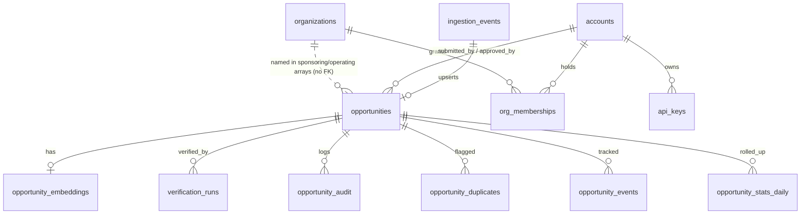

# RFP Hub — Postgres Data Model (sketch)

Storage model backing the public `/v1/` API (M2).
Target: **PostgreSQL 15+** with `pgvector` (semantic dedup) and `pg_trgm`. This is the
*internal* model — a clean-slate redesign, intentionally NOT a copy of any single source
system's schema. It maps onto, but is independent from, the public
[RFP Hub Standard v1.0.0](../../standard/schemas/v1.0.0/opportunity.schema.json).

## M2 implementation status

This document is the **full design target**. M2 (the public read layer) deliberately implements
only a **subset**; the rest is built in later milestones. The implemented slice lives in
`packages/api/src/db/schema.ts` (Drizzle) — kept in sync with the `✅ M2` rows below. Nothing here
is deleted: this doc stays the canonical reference so deferred work remains discoverable.

**Legend:** ✅ M2 (implemented now) · ⏳ M3 · ⏳ M4 (deferred)

> **Re-cut note.** This model tracks **RFP Hub Standard v1.0.0 as re-cut** (see the field
> mapping table in `packages/standard/CHANGELOG.md`). Because the standard was re-cut *in place*
> and nothing had been published from this database yet, `src/db/migrations` was **regenerated
> from scratch** into a single `0000_recut_v1_0_0` migration rather than carrying a rename chain
> — the migration directory stays 100% drizzle-kit output and is never hand-edited. Applying it
> to a database that already holds the pre-re-cut schema will fail: drop and re-migrate, then
> re-run the seed (every row is re-derivable from the corpus file).

| Table / feature | Status |
|---|---|
| `organizations` (minus `verified`) — the org **directory**, written on ingest | ✅ M2 |
| `opportunities` core columns + provenance + `text[]`/GIN + `jsonb` org arrays / `deadlines` / `type_data` | ✅ M2 |
| `opportunities.next_deadline_at` (derived, denormalized) + `ix_opp_next_deadline` | ✅ M2 |
| `dataset_snapshots` (nightly export bookkeeping) | ✅ M2 |
| `opportunities.search_tsv` generated `tsvector` column + `gin_opp_search` | ⏳ deferred (use `ILIKE`/`pg_trgm` in M2; add when data volume warrants) |
| `gin_opp_typedata` (GIN on `type_data`) | ⏳ deferred (M2 never filters inside `type_data`) |
| `organizations.verified` + `/publishers` | ⏳ M3 (verification is a publishing-relationship concern) |
| `accounts`, `api_keys`, `organizations` membership, `org_memberships` (auth tiers T1–T4) | ⏳ M3 (write API) |
| `verification_runs`, `opportunity_audit`, `opportunity_duplicates`, `opportunity_embeddings` (pgvector) | ⏳ M3 |
| `ingestion_events` (outbox idempotency) | ⏳ M3 |
| `opportunity_events` (partitioned) + `opportunity_stats_daily` | ⏳ M3 (publisher dashboard analytics) |

**M2 read path (what the `/v1/` API actually touches):** `opportunities` alone, filtered by
`review_status='approved' AND is_listed` — reads no longer join `organizations` (see
"Organizations" below). `text[]`+GIN backs the ecosystem/category/organization filters,
`numeric` award columns back the grant-size ranges, `next_deadline_at` backs the deadline sort and
window filters, and `ILIKE` over `title`/`summary`/`description` backs the `q` text search (the
generated `tsvector` column is **deferred** — premature at the M2 dataset size).
`dataset_snapshots` records each nightly export.

Each ⏳ table/feature below is annotated inline where it appears.

## Principles

1. **Hybrid relational + JSONB.** Typed columns for everything the API filters/sorts/searches
   on (the live filters are funding type, ecosystem, category, status, grant size, organization,
   deadline window, text). `JSONB` for the genuinely variable or order-significant bits: the
   per-type block, the organization arrays, `deadlines` and `milestones`.
2. **One tagged-union slot via one JSONB column.** The Standard models the type-specific details
   as a single required `fundingDetails` property — a `oneOf` tagged union whose required inner
   `fundingType` tag equals the top-level discriminator (a binding `allOf` keeps the two in
   step). The payload lives in `opportunities.type_data` **without the tag**: the tag is
   derivable from the `funding_type` column, so storing it twice would only let the copies
   disagree. The read path reattaches it (`toStandard` emits
   `fundingDetails = { fundingType: row.fundingType, ...type_data }`), which makes a mismatched
   served tag structurally impossible. A second type block is likewise unrepresentable — one
   slot, one shape — so the old `assertSingleTypeBlock` ingest guard is gone.
3. **Derive-then-denormalize for anything sortable that lives in an array.** The Standard has no
   sortable deadline scalar — `deadlines[]` is an array of `{deadlineType, date?, label?}`. The API
   derives `next_deadline_at` (earliest **future** `fixed` entry) and stores it in a real,
   indexed column, recomputed on every write. Nothing sorts or ranges over JSONB.
4. **Provenance-first, but not schema-enforced.** The re-cut removed `source.url` and left
   `source` with no required member, so provenance completeness is an **ingestion-policy**
   concern here, not a `NOT NULL`. `application_url` is the single link-back target and the
   verification job's only fetch target. Verification history and source snapshots are
   append-only side tables.
5. **Append-only history.** Audit trail, verification runs, analytics events, and dataset
   snapshots are insert-only (no UPDATE/DELETE) — satisfies the M3 "append-only audit trail".
6. **Editorial state is server-side.** `review_status` (pending/approved/rejected) is a column,
   never exposed in the public object; public reads filter to approved + listed.
7. **Idempotent ingestion.** M2 ingest (seed/upsert) keys on the unique `public_id`.
   `(source_system, original_id)` carries a **partial** unique index (`ux_opp_source`, only rows
   where both are non-NULL — source-less community submissions stay unconstrained) as the
   cross-system key for the M3 outbox, which is additionally deduped by an event-id table so
   at-least-once delivery is safe.

## ERD


```mermaid
erDiagram
    organizations ||..o{ opportunities : "named in sponsoring/operating arrays (no FK)"
    organizations ||--o{ org_memberships : grants
    accounts      ||--o{ org_memberships : holds
    accounts      ||--o{ api_keys : owns
    accounts      ||--o{ opportunities : "submitted_by / approved_by"
    opportunities ||--o| opportunity_embeddings : has
    opportunities ||--o{ verification_runs : verified_by
    opportunities ||--o{ opportunity_audit : logs
    opportunities ||--o{ opportunity_duplicates : flagged
    opportunities ||--o{ opportunity_events : tracked
    opportunities ||--o{ opportunity_stats_daily : rolled_up
    ingestion_events ||--o| opportunities : upserts
```

## Enums

```sql
CREATE TYPE funding_type       AS ENUM ('grant','hackathon','bounty','accelerator','vc_fund','rfp');
CREATE TYPE opportunity_status AS ENUM ('upcoming','open','closed','archived');   -- public lifecycle
CREATE TYPE review_status      AS ENUM ('pending','approved','rejected');         -- server-side editorial
CREATE TYPE ingestion_method   AS ENUM ('publisher_api','submission','scrape','import','outbox');
CREATE TYPE account_role       AS ENUM ('submitter','reviewer','admin');          -- T1 / T3 / T4 (T0=no account, T2=via org membership)
CREATE TYPE org_role           AS ENUM ('owner','admin','publisher');             -- a user's role within an org
CREATE TYPE org_type           AS ENUM ('foundation','dao','company','protocol','program','individual','other');
CREATE TYPE audit_action       AS ENUM ('create','update','approve','reject','merge','close','reopen','claim','grant_publisher','revoke_publisher');
CREATE TYPE dup_status         AS ENUM ('suspected','confirmed','dismissed','merged');
CREATE TYPE analytics_event    AS ENUM ('list_view','detail_view','source_click','apply_click');
```

## Core table: `opportunities`

```sql
CREATE TABLE opportunities (
  id                 BIGINT GENERATED ALWAYS AS IDENTITY PRIMARY KEY,  -- internal FK target
  public_id          TEXT NOT NULL UNIQUE,            -- standard `id`, e.g. 'filecoin:propgf-batch-3'
  spec_version       TEXT NOT NULL DEFAULT '1.0.0',
  funding_type       funding_type       NOT NULL,     -- the Standard's structural discriminator
  status             opportunity_status NOT NULL,

  title              TEXT NOT NULL,
  description        TEXT NOT NULL,
  summary            TEXT,

  -- Organizations: ARRAYS with semantic order ([0] = primary/display), each optionally carrying
  -- contacts[]. Stored verbatim as JSONB and served back unchanged — an FK can only carry one
  -- organization and cannot carry order, so reads do not join `organizations` at all.
  -- `operating_organizations` is THE primary array (required, min 1 app-side per the Standard);
  -- sponsors are optional and may be empty.
  sponsoring_organizations JSONB NOT NULL DEFAULT '[]',
  operating_organizations  JSONB NOT NULL,            -- min 1 (enforced app-side by the Standard)
  org_slugs          TEXT[] NOT NULL DEFAULT '{}',    -- denormalized ?organization= key: operating ∪ sponsoring slugs

  application_url    TEXT,                            -- the single link-back target
  website            TEXT,
  logo_url           TEXT,
  banner_url         TEXT,
  social_links       JSONB NOT NULL DEFAULT '[]',     -- [{platform, url}] entries; not filtered

  -- classification (open lists per the ETH-scoped standard) — filtered via GIN
  ecosystems         TEXT[] NOT NULL DEFAULT '{}',
  categories         TEXT[] NOT NULL DEFAULT '{}',

  -- free-flow eligibility text + free-text qualifiers (deliberately NOT filterable)
  eligibility        TEXT,
  prerequisites      TEXT,
  additional_references TEXT,
  service_agreement  TEXT,

  -- funding envelope (grant-size filters). `allocated` = COMMITTED to date, not disbursed;
  -- `remaining` is derived (budget − allocated) at the consumer layer and never stored.
  currency           TEXT,
  min_award          NUMERIC,
  max_award          NUMERIC,
  budget             NUMERIC,
  allocated          NUMERIC,

  milestones         JSONB NOT NULL DEFAULT '[]',     -- array order IS the sequence

  -- dates
  opens_at           TIMESTAMPTZ,
  deadlines          JSONB NOT NULL DEFAULT '[]',     -- [{deadlineType:'fixed'|'rolling', date?, label?}]
  next_deadline_at   TIMESTAMPTZ,                     -- DERIVED: earliest FUTURE fixed deadline
  posted_at          TIMESTAMPTZ,

  -- discriminated-union payload (served as `fundingDetails`, tag reattached on read)
  type_data          JSONB NOT NULL DEFAULT '{}',     -- = fundingDetails minus its fundingType tag

  -- provenance (1:1) — ✅ M2. No column is NOT NULL: the Standard's `source` has no required
  -- member since the re-cut, so completeness is an ingestion-policy concern.
  source_publisher       TEXT,                         -- namespace (= organizations.slug)
  source_submitted_by    TEXT,                         -- Standard source.submittedBy (public handle/slug/'community')
  source_submitted_at    TIMESTAMPTZ,                  -- Standard source.submittedAt
  ingested_via           ingestion_method,
  source_system          TEXT,                         -- e.g. an upstream system id
  original_id            TEXT,                         -- id in the source system
  verified_against_source BOOLEAN,                     -- (set by M3 verification-assist; column ✅ M2)
  verified_at            TIMESTAMPTZ,
  snapshot_url           TEXT,                          -- latest source snapshot (IPFS/archive)

  -- editorial / server-side (never in public object)
  review_status      review_status NOT NULL DEFAULT 'pending',  -- ✅ M2
  is_listed          BOOLEAN NOT NULL DEFAULT TRUE,     -- ✅ M2; soft hide without delete
  submitted_by       BIGINT REFERENCES accounts(id),    -- ⏳ M3 (needs accounts)
  approved_by        BIGINT REFERENCES accounts(id),    -- ⏳ M3
  approved_at        TIMESTAMPTZ,                        -- ⏳ M3

  -- staleness — ⏳ M3
  last_seen_at       TIMESTAMPTZ,                       -- last confirmed-at-source / publisher touch

  -- full-text search (weighted)
  search_tsv         tsvector GENERATED ALWAYS AS (
                        setweight(to_tsvector('english', coalesce(title,'')), 'A') ||
                        setweight(to_tsvector('english', coalesce(summary,'')), 'B') ||
                        setweight(to_tsvector('english', coalesce(description,'')), 'C')
                     ) STORED,

  created_at         TIMESTAMPTZ NOT NULL DEFAULT now(),
  updated_at         TIMESTAMPTZ NOT NULL DEFAULT now()
);

-- cross-system key (M3 outbox/import): PARTIAL unique — only rows carrying BOTH a source system
-- and an original id are deduped; source-less community submissions stay unconstrained.
CREATE UNIQUE INDEX ux_opp_source ON opportunities (source_system, original_id)
  WHERE source_system IS NOT NULL AND original_id IS NOT NULL;

-- hot public query: approved + active
CREATE INDEX ix_opp_public_live   ON opportunities (status, next_deadline_at)
  WHERE review_status = 'approved' AND is_listed;
CREATE INDEX ix_opp_funding_type  ON opportunities (funding_type);
CREATE INDEX ix_opp_next_deadline ON opportunities (next_deadline_at);
CREATE INDEX ix_opp_budget        ON opportunities (budget);
CREATE INDEX ix_opp_award         ON opportunities (min_award, max_award);
CREATE INDEX ix_opp_updated       ON opportunities (updated_at DESC);
CREATE INDEX gin_opp_ecosystems   ON opportunities USING gin (ecosystems);
CREATE INDEX gin_opp_categories   ON opportunities USING gin (categories);
CREATE INDEX gin_opp_org_slugs    ON opportunities USING gin (org_slugs);
CREATE INDEX gin_opp_search       ON opportunities USING gin (search_tsv);
CREATE INDEX gin_opp_typedata     ON opportunities USING gin (type_data jsonb_path_ops);
```

`type_data` shape is enforced **app-side** by the same JSON Schema the `rfphub-validate` CLI
uses. Optionally enforce in-DB with the `pg_jsonschema` extension as a `CHECK`.

### Deadlines: `deadlines[]`, `next_deadline_at`, and auto-close

The Standard has **no** deadline scalar. `deadlines` is an array of
`{type: 'fixed' | 'rolling', date?, label?}` where consumers must **select by label**, never by
array position (the head of a hackathon's array is its event start, not its application deadline).
That leaves nothing to sort or range-scan on, so the API derives two things — both pure functions
in `src/modules/shared/deadlines.ts`, both unit-tested:

| Derivation | Definition | Used by |
|---|---|---|
| **`next_deadline_at`** | The earliest `fixed` entry whose `date` is **in the future**. `NULL` when the record is rolling-only, all its fixed dates have passed, or it has no deadlines. | `?sort=nextDeadlineAt`, `?deadlineAfter=`/`?deadlineBefore=`, the CSV export |
| **`isPastDue`** | The **latest** `fixed` entry is in the past **AND** there is **no** `rolling` entry. | staleness auto-close (⏳ M3) |

`next_deadline_at` is a real, indexed `TIMESTAMPTZ` column, **denormalized and recomputed on every
write** (`fromStandard` → `OpportunityService.upsertFromStandard`). It is deliberately *not* a
generated column: "in the future" depends on `now()`, which Postgres will not accept in a
`GENERATED ALWAYS AS` expression, and a JSONB expression index could not answer a range query on
"earliest future fixed date" anyway. The consequence is that the value goes stale as time passes —
a row whose next deadline elapses keeps pointing at that past instant until it is rewritten. The
M3 staleness job that already has to walk the table for auto-close recomputes it in the same pass;
until then the seed/ingest path refreshes it on every upsert.

**Null semantics are load-bearing and public.** Records with a `NULL` `next_deadline_at` sort
**last** in both directions (`ORDER BY next_deadline_at ASC/DESC NULLS LAST`) and are **excluded**
from the `deadlineAfter`/`deadlineBefore` window filters, because there is no date to compare. That
exclusion is documented on each of those parameters in the OpenAPI document — a rolling program
silently vanishing from a deadline-window query would otherwise look like a bug.

**Auto-close is re-keyed, not just renamed.** The pre-re-cut rule was `closes_at < now()`. The
replacement is *not* "latest fixed deadline < now()" on its own: a program that publishes both an
old fixed date and a `rolling` entry is still accepting applications, so **a rolling program never
auto-closes**, however old its fixed dates are.

### Organizations

`operatingOrganizations` is the **required, primary** array with **semantic order** (`[0]` is the
primary/display organization); `sponsoringOrganizations` is an optional second array (absent or
empty when no backer is published), and each entry may carry `contacts[]`.
An FK can express neither multiplicity nor order, so both arrays are stored verbatim as JSONB on
the opportunity and are served back byte-for-byte — which is also what keeps the mapper round-trip
exact against the Standard's committed examples.

`organizations` survives as the **directory / namespace registry**, not as a read-path join: every
operating *and* sponsoring organization is upserted into it on ingest, keyed by `slug` (a
Standard-required field since the re-cut). That is what M3's `verified` flag, `/publishers`
and `org_memberships` hang off.

Filtering by organization would otherwise mean a JSONB containment scan, so `org_slugs` carries the
**union** of every operating and sponsoring organization slug, GIN-indexed.
`?organization=<slug>` therefore matches an organization in **either role**, in any array
position — not only the primary `operatingOrganizations[0]` entry.

## Identity & access (Privy separate app + API keys)

> **Mostly deferred → M3.** M2 is unauthenticated read-only (tier T0 only). **Exception:**
> `organizations` **is** created and used by M2 (embedded on each opportunity) — but **without** the
> `verified` / `verified_at` columns, which power `/publishers` and land with M3. `accounts`,
> `api_keys`, and `org_memberships` are entirely ⏳ M3 (they arrive with the write API).

**Model:** `accounts` are principals; `organizations` are issuers/namespaces (optionally `verified` publishers); `org_memberships` grant an account publishing rights on an org. A user can be permissioned on **many** orgs. **There is no separate publisher entity** — "publisher" = a user permissioned on a verified org.

```sql
CREATE TABLE accounts (
  id             BIGINT GENERATED ALWAYS AS IDENTITY PRIMARY KEY,
  privy_did      TEXT UNIQUE,            -- from the SEPARATE Privy app (PII isolated from any source system)
  primary_wallet TEXT,
  email          TEXT,                   -- optional; PII — lives only in this app
  display_name   TEXT,
  global_role    account_role NOT NULL DEFAULT 'submitter',   -- T1 default; T3/T4 elevate
  created_at     TIMESTAMPTZ NOT NULL DEFAULT now(),
  updated_at     TIMESTAMPTZ NOT NULL DEFAULT now()
);

CREATE TABLE api_keys (
  id           BIGINT GENERATED ALWAYS AS IDENTITY PRIMARY KEY,
  account_id   BIGINT NOT NULL REFERENCES accounts(id) ON DELETE CASCADE,
  name         TEXT,
  key_prefix   TEXT NOT NULL,            -- shown in UI for identification
  key_hash     TEXT NOT NULL,            -- store hash only (never the secret)
  scopes       TEXT[] NOT NULL DEFAULT '{read}',   -- read | write | publish
  created_at   TIMESTAMPTZ NOT NULL DEFAULT now(),
  last_used_at TIMESTAMPTZ,
  expires_at   TIMESTAMPTZ,
  revoked_at   TIMESTAMPTZ
);
CREATE UNIQUE INDEX ux_api_keys_hash ON api_keys (key_hash);

CREATE TABLE organizations (   -- ✅ M2 (except the two `verified*` columns below)
  id            BIGINT GENERATED ALWAYS AS IDENTITY PRIMARY KEY,
  slug          TEXT NOT NULL UNIQUE,    -- the org's NAMESPACE (e.g. 'filecoin')
  name          TEXT NOT NULL,
  org_type      org_type,
  description   TEXT,
  website       TEXT,
  logo_url      TEXT,
  banner_url    TEXT,
  social_links  JSONB NOT NULL DEFAULT '[]',       -- [{platform, url}] entries
  ecosystems    TEXT[] NOT NULL DEFAULT '{}',
  contacts      JSONB NOT NULL DEFAULT '[]',       -- ✅ M2; the re-cut's organization.contacts[]
  verified      BOOLEAN NOT NULL DEFAULT FALSE,   -- ⏳ M3; approved-publisher status; powers /publishers
  verified_at   TIMESTAMPTZ,                      -- ⏳ M3
  created_at    TIMESTAMPTZ NOT NULL DEFAULT now(),
  updated_at    TIMESTAMPTZ NOT NULL DEFAULT now()
);

-- A user's publishing permissions for an org. A user MAY belong to many orgs (multiple rows);
-- an org may have many users. There is no separate "publisher" entity — publishing is a
-- permission an account holds on an organization.
CREATE TABLE org_memberships (
  id              BIGINT GENERATED ALWAYS AS IDENTITY PRIMARY KEY,
  account_id      BIGINT NOT NULL REFERENCES accounts(id) ON DELETE CASCADE,
  organization_id BIGINT NOT NULL REFERENCES organizations(id) ON DELETE CASCADE,
  role            org_role NOT NULL DEFAULT 'publisher',
  created_at      TIMESTAMPTZ NOT NULL DEFAULT now(),
  UNIQUE (account_id, organization_id)
);
```

**Auth-tier mapping (T0–T4 from the Q&A):**

| Tier | How it's represented |
|---|---|
| **T0** Public | no account; read approved+listed only |
| **T1** Submitter | any `accounts` row / API key with `write` scope → writes land `review_status='pending'` |
| **T2** Verified Publisher | an `org_memberships` row linking the account to a `verified` org → writes **within that org's namespace** auto-approve with verified provenance; out-of-namespace falls back to T1. A user can hold memberships across **multiple** orgs. No separate publisher entity — "publisher" = a user permissioned on a verified org. |
| **T3** Reviewer | `accounts.global_role='reviewer'` → approve/reject, merge dupes, grant/revoke publisher |
| **T4** Admin | `accounts.global_role='admin'` → assign/revoke reviewers |

## Supporting tables (abbreviated)

> ⏳ **Deferred → M3/M4**, except `dataset_snapshots` (✅ M2). The verification, audit, dedup,
> embedding, outbox, and analytics tables below are NOT in the M2 migration — see the status table
> at the top.

```sql
-- M3 scraping/verification-assist: append-only run log + source snapshots
CREATE TABLE verification_runs (
  id               BIGINT GENERATED ALWAYS AS IDENTITY PRIMARY KEY,
  opportunity_id   BIGINT NOT NULL REFERENCES opportunities(id) ON DELETE CASCADE,
  run_at           TIMESTAMPTZ NOT NULL DEFAULT now(),
  http_status      INT,
  exists_at_source BOOLEAN,           -- anti-spam check
  extracted        JSONB,             -- fields parsed from the page
  field_diff       JSONB,             -- mismatches vs the submission
  matched          BOOLEAN,           -- => opportunities.verified_against_source
  snapshot_url     TEXT,              -- IPFS/archived snapshot
  snapshot_sha256  TEXT
);  -- INSERT-only

-- M3 append-only audit trail of every mutation
CREATE TABLE opportunity_audit (
  id               BIGINT GENERATED ALWAYS AS IDENTITY PRIMARY KEY,
  opportunity_id   BIGINT NOT NULL REFERENCES opportunities(id) ON DELETE CASCADE,
  actor_account_id BIGINT REFERENCES accounts(id),     -- null for system jobs
  actor_kind       TEXT NOT NULL,                       -- user | api_key | job | outbox
  action           audit_action NOT NULL,
  patch            JSONB,                               -- RFC-6902 / before-after diff
  created_at       TIMESTAMPTZ NOT NULL DEFAULT now()
);  -- INSERT-only (revoke UPDATE/DELETE)

-- M3 semantic dedup at submission (pgvector)
CREATE TABLE opportunity_embeddings (
  opportunity_id BIGINT PRIMARY KEY REFERENCES opportunities(id) ON DELETE CASCADE,
  model          TEXT NOT NULL,
  embedding      vector(1536) NOT NULL,
  content_hash   TEXT NOT NULL,
  created_at     TIMESTAMPTZ NOT NULL DEFAULT now()
);
CREATE INDEX ix_opp_embed ON opportunity_embeddings USING hnsw (embedding vector_cosine_ops);

CREATE TABLE opportunity_duplicates (
  id              BIGINT GENERATED ALWAYS AS IDENTITY PRIMARY KEY,
  opportunity_id  BIGINT NOT NULL REFERENCES opportunities(id) ON DELETE CASCADE,
  duplicate_of_id BIGINT NOT NULL REFERENCES opportunities(id) ON DELETE CASCADE,
  similarity      NUMERIC,
  status          dup_status NOT NULL DEFAULT 'suspected',
  reviewed_by     BIGINT REFERENCES accounts(id),
  detected_at     TIMESTAMPTZ NOT NULL DEFAULT now(),
  reviewed_at     TIMESTAMPTZ,
  UNIQUE (opportunity_id, duplicate_of_id)
);  -- intra-Hub only; cross-system (Hub ↔ external aggregator) dedup deferred

-- Upstream → Hub outbox idempotency
CREATE TABLE ingestion_events (
  id            BIGINT GENERATED ALWAYS AS IDENTITY PRIMARY KEY,
  event_id      TEXT NOT NULL UNIQUE,        -- idempotency key from the outbox
  source_system TEXT NOT NULL,
  original_id   TEXT,
  event_type    TEXT NOT NULL,               -- upsert | delete
  payload       JSONB NOT NULL,
  received_at   TIMESTAMPTZ NOT NULL DEFAULT now(),
  processed_at  TIMESTAMPTZ,
  opportunity_id BIGINT REFERENCES opportunities(id),
  status        TEXT NOT NULL DEFAULT 'received'  -- received | processed | failed | skipped
);

-- Publisher dashboard analytics (M3): high-volume, partition by month
CREATE TABLE opportunity_events (
  id             BIGINT GENERATED ALWAYS AS IDENTITY,
  opportunity_id BIGINT NOT NULL,
  event_type     analytics_event NOT NULL,
  occurred_at    TIMESTAMPTZ NOT NULL DEFAULT now(),
  session_hash   TEXT, ip_hash TEXT, referrer TEXT
) PARTITION BY RANGE (occurred_at);

CREATE TABLE opportunity_stats_daily (   -- rollup feeding the dashboard
  opportunity_id BIGINT NOT NULL REFERENCES opportunities(id) ON DELETE CASCADE,
  day            DATE NOT NULL,
  views          INT NOT NULL DEFAULT 0,
  source_clicks  INT NOT NULL DEFAULT 0,
  apply_clicks   INT NOT NULL DEFAULT 0,
  PRIMARY KEY (opportunity_id, day)
);

-- M2 nightly exports + CC0/IPFS snapshots
CREATE TABLE dataset_snapshots (
  id           BIGINT GENERATED ALWAYS AS IDENTITY PRIMARY KEY,
  created_at   TIMESTAMPTZ NOT NULL DEFAULT now(),
  format       TEXT NOT NULL,        -- json | csv
  entry_count  INT NOT NULL,
  url          TEXT NOT NULL,        -- public bucket
  ipfs_cid     TEXT,
  sha256       TEXT,
  spec_version TEXT NOT NULL
);  -- INSERT-only
```

## Standard ↔ storage mapping

| Standard field | Storage |
|---|---|
| `id` | `opportunities.public_id` |
| `specVersion`,`fundingType`,`status`,`title`,`description`,`summary` | same-named columns |
| `operatingOrganizations[]` / `sponsoringOrganizations[]` | `operating_organizations` / `sponsoring_organizations` JSONB (verbatim, order preserved) + derived `org_slugs` `TEXT[]` (GIN, operating ∪ sponsoring) |
| `source{}` | `source_publisher`, `source_submitted_by` (= `source.submittedBy`), `source_submitted_at` (= `source.submittedAt`), `ingested_via`, `source_system`, `original_id`, `verified_against_source`, `verified_at`, `snapshot_url`. **`source.url` was removed by the re-cut** and has no column. |
| `ecosystems`/`categories` | `TEXT[]` columns (GIN) |
| `eligibility` | `eligibility` TEXT (free text, nullable) |
| `prerequisites`/`additionalReferences`/`serviceAgreement` | same-named `TEXT` columns |
| `applicationUrl`/`website`/`logoUrl`/`bannerUrl`/`socialLinks` | same-named columns (`social_links` JSONB) |
| `fundingInfo{}` | `currency`,`min_award`,`max_award`,`budget`,`allocated` |
| `milestones[]` | `milestones` JSONB (array order = sequence) |
| `deadlines[]` | `deadlines` JSONB, **plus the derived `next_deadline_at`** column |
| `opensAt`/`postedAt`/`createdAt`/`updatedAt` | `*_at` columns |
| `fundingDetails` (tagged union of the six detail shapes) | **`type_data` JSONB**, stored **without** the inner `fundingType` tag (derivable from `funding_type`; reattached on read) |
| `$schema`/`@context`/`@type` | accepted on ingest and **stripped** — they describe the document, not the opportunity |
| *(not in standard)* `review_status`,`is_listed`,`submitted_by`,`approved_by`,`last_seen_at` | server-side only |

## Key flows

- **Read (T0):** `WHERE review_status='approved' AND is_listed` (+ filters), no joins. List =
  column projection minus `type_data` (thin lists); detail = full row, `type_data` served as
  `fundingDetails` with the `fundingType` tag reattached from the `funding_type` column.
- **Write (T1/T2):** validate body against the Standard → resolve org/namespace → if the
  account has an `org_memberships` row for that org and the org is `verified` →
  `review_status='approved'` + run verification; else `'pending'` (community submit — no
  membership required). Every write inserts an `opportunity_audit` row.
- **Ingestion (outbox, M3):** upsert keyed by `(source_system, original_id)` (the partial
  `ux_opp_source` index; today's M2 ingest upserts on `public_id`), deduped by
  `ingestion_events.event_id`; `ingested_via='outbox'`. One-way only — the Hub never
  reads back into the source system.
- **Verification (M3):** job fetches `application_url` (the re-cut's only link-back target — the
  removed `source.url` used to serve this), writes a `verification_runs` row, sets
  `verified_against_source`/`verified_at`/`snapshot_url` on the opportunity.
- **Dedup (M3):** on submit, embed the entry, ANN-search `opportunity_embeddings`, record
  matches in `opportunity_duplicates`, notify submitter.
- **Staleness (M3):** job sets `status='closed'` where the record `isPastDue` — the latest `fixed`
  entry in `deadlines` is in the past **and** the record carries no `rolling` entry (so rolling
  programs never auto-close). It recomputes `next_deadline_at` in the same pass. Also auto-closes
  rows inactive 90+ days (by `last_seen_at`/`updated_at`). Logged in `opportunity_audit`.
  The predicate lives in `src/modules/shared/deadlines.ts` and is unit-tested today, ahead of the
  job that will call it.

## Open questions / deferred

- **Cross-system dedup** (Hub ETH ↔ an external aggregator's non-ETH registry) — deferred. The
  partial `(source_system, original_id)` index + `opportunity_duplicates` give us hooks, but the
  merge-precedence policy at the aggregation layer is unresolved.
- **In-DB JSONB validation** of `type_data` — optional `pg_jsonschema` CHECK vs app-only.
- **Taxonomy canonicalization** — `TEXT[]` now; a `taxonomy_terms` table (labels + aliases)
  could later canonicalize "Optimism" vs "OP Mainnet". ETH-scope is a soft/app concern, not a
  DB constraint.
- **ID scheme** — `public_id` as a human namespaced slug vs opaque ULID. Slug is friendlier and
  matches the standard examples; needs a collision/derivation rule.
- **Embedding model/dim** — `vector(1536)` is a placeholder pending the dedup model choice.
